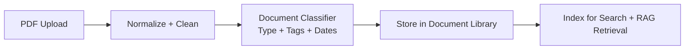
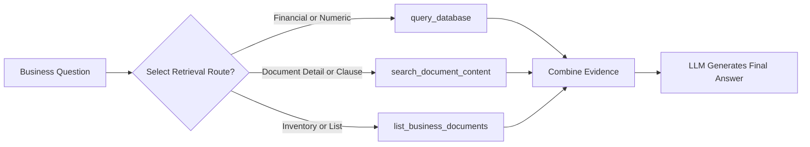
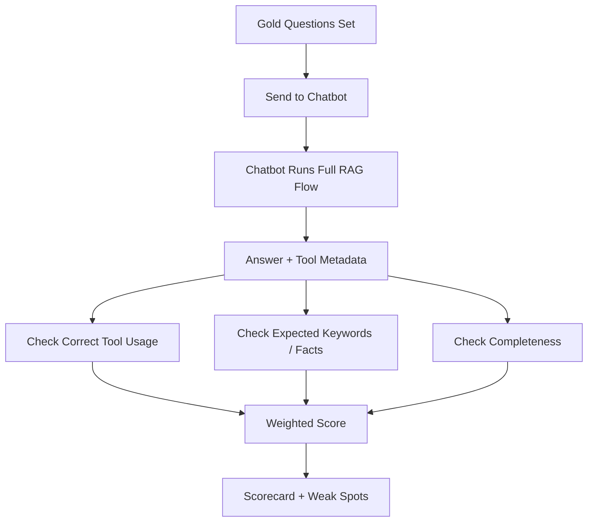
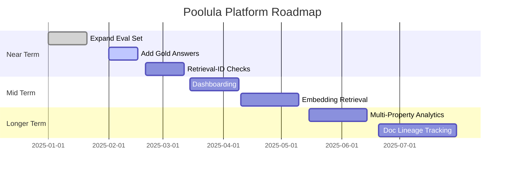

# Poolula Platform — Executive Summary
**Last Updated: 2025-12-10**

This document provides a high-level, business-friendly overview of the Poolula Platform — what it does, how it works, and how we ensure the AI chatbot gives accurate, reliable, and trustworthy answers.

---

## 1. What the Platform Does (Plain Language)

Poolula is a centralized system that helps a property-holding LLC stay organized, audit-ready, and financially clear.

The platform:

- Stores **all structured business data** (properties, transactions, obligations, tax items).  
- Organizes **all business documents** (insurance, filings, agreements, statements).  
- Offers a **chatbot assistant** that answers questions using your actual data and documents.  
- Includes an **evaluation harness** to verify the chatbot’s accuracy over time.

Think of it as a combined **financial dashboard**, **document vault**, and **AI analyst** that stays current as new data and documents arrive.

```mermaid
flowchart TD
    User[User] --> Chatbot[Chatbot (RAG Engine)]

    subgraph Retrieval
        DB[Structured Data<br/>Properties, Transactions, Obligations]
        Docs[Document Store<br/>PDFs, Policies, Agreements]
    end

    Chatbot --> Retrieval
    Retrieval --> Processing[LLM Processing<br/>Citations + Synthesis]
    Processing --> Output[Final Answer<br/>With Source Links]

    Processing --> EvalHarness[Evaluation Harness]
    EvalHarness --> Score[Scorecard + Trends]
```

---

## 2. What Problems This Solves

The platform reduces risk and increases clarity by ensuring:

- All business-critical information is in one structured place  
- Every document is searchable, versioned, and easily referenced  
- Financial questions can be answered consistently (not buried in spreadsheets)  
- Tax, compliance, and governance questions can be handled quickly  
- The chatbot provides *trustworthy* guidance thanks to automated evaluation

This creates a reliable, repeatable workflow for operations, tax season, loan applications, and internal decision-making.



---

## 3. How the System Works (High-Level)

### **A. Structured Data**
- Properties  
- Transactions (income, expenses, improvements, transfers)  
- Obligations (insurance, filings, renewals)  

### **B. Document Storage**
- Uploaded PDFs and scans  
- Tagged by type, coverage dates, and business relevance  

### **C. RAG Chatbot**
The AI assistant uses a Retrieval-Augmented Generation (RAG) approach:

1. Retrieve business data  
2. Retrieve relevant documents  
3. Draft an answer with citations  
4. Provide sources for verification  



---

## 4. Ensuring Accuracy: The Evaluation Harness

The evaluation harness is the system’s **quality-control lane**.

Each week it:

1. Runs a fixed set of important “gold questions”  
2. Checks whether the chatbot:  
   - Used the right data source  
   - Retrieved the right information  
   - Provided the expected facts  
   - Avoided hallucinations or errors  
3. Produces a scorecard (per question + overall)

This allows us to catch issues *before* they impact decision-making.



---

## 5. Current Strengths

- End-to-end system covering data, documents, and AI  
- Fast, trustworthy answers to real business questions  
- Automated accuracy verification  
- Clear structure for future expansion  

---

## 6. What’s Next (Roadmap Overview)



**Near-Term**
- Expand question set to 50–75 items  
- Add reference (gold) answers  
- Improve document-retrieval fidelity checks  
- Add versioned trend tracking  

**Mid-Term**
- Add reporting dashboards  
- Add multi-property and seasonal analysis queries  
- Add embedded financial statements  

**Long-Term Vision**
Position Poolula as a personal “LLC Operating System” — a turnkey, always-ready structure for small property-holding businesses.

---

## 7. How to Use This Document

Share this summary with:
- CPAs  
- Advisors  
- Future collaborators  
- Anyone who needs the business view of Poolula  

Technical collaborators should read the main `README.md` for implementation details.

