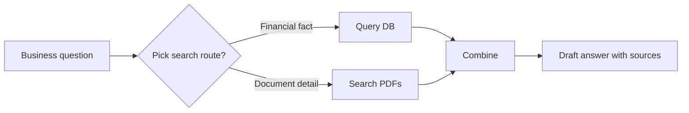

# Poolula Platform — Technical README
**Last Updated: 2025-02-12**

This README explains how to install, run, extend, and evaluate the Poolula Platform as a developer or technical collaborator. It includes system architecture, data models, document flows, chatbot logic, and extensibility guidelines.

For a business-level overview, see **EXECUTIVE_SUMMARY.md**.

---

# 1. System Overview

The Poolula Platform contains three layers:

1. **Structured Data Layer** (SQLModel)  
2. **Document Management Layer**  
3. **Chatbot + Evaluation Harness (RAG pipeline)**  

Each layer is modular, testable, and extensible.

---

# 2. Architecture Diagram (High-Level)

```mermaid
flowchart TD
  A[User] --> B[Chatbot (RAG)]
  B --> C{Retrieval Step}
  C -->|Structured| D[Database: Properties, Transactions, Obligations]
  C -->|Documents| E[PDF Document Store]
  D --> F[Combined Evidence]
  E --> F
  F --> G[LLM Answer with Citations]
  G --> H[Evaluation Harness]
  H --> I[Scorecard]
```

---

# 3. Structured Data Models

The core domain models include:

- **Property**  
- **Transaction** (income, expense, improvement, transfer, etc.)  
- **Obligation** (insurance, compliance, renewals)  

Each model includes:
- SQLModel schema  
- CRUD operations  
- Validation rules  
- Example seeds  

---

# 4. Document Management

All documents are:
- Uploaded as PDFs  
- Normalized  
- Parsed for metadata  
- Classified by type (Agreement, Filing, Insurance, Lease…)  
- Searchable for RAG retrieval  

Future extensions include:
- Embedding search  
- Version history  
- Document lineage tracking  

---

# 5. Chatbot Architecture (RAG)

The chatbot uses:

- Retrieval pipeline  
- Tool functions:
  - `query_database`
  - `search_document_content`
  - `list_business_documents`
- LLM summarization with citation rendering  

Diagram:



---

# 6. Evaluation Harness (Technical Details)

The harness tests:
- Tool correctness  
- Keyword/expected content appearance  
- Completeness and error handling  

Weights:
- **40% Tool Choice**  
- **40% Content Match**  
- **20% Completeness**  

Script locations:
- `apps/evaluator/poolula_eval_set.jsonl`  
- `scripts/evaluate_chatbot.py`  

---

# 7. Current Limitations

- Only 15 evaluation questions  
- Keyword-based scoring can miss numeric inaccuracies  
- Tool detection is inferred from citations  
- No retrieval-ID matching  
- Limited red-team/negative tests  

---

# 8. Extending the System

### Add a New Transaction Category
1. Update model enum  
2. Add migration  
3. Add example seeds  
4. Add evaluation questions targeting it  

### Add a New Document Type
1. Add classifier tag  
2. Update document metadata schema  
3. Add retrieval tests  
4. Add evaluation questions  

### Add Chatbot Capabilities
1. Add a new tool function  
2. Add evaluation cases  
3. Update RAG routing logic  
4. Add unit tests  

---

# 9. Development Setup

```
pip install -r requirements.txt
alembic upgrade head
uvicorn app.main:app --reload
```

---

# 10. Roadmap (Technical)

**Now**
- Expand evaluation set  
- Add structured gold answers  
- Add retrieval-ID verification  

**Next**
- Add dashboard visualizations  
- Expand RAG retriever with embeddings  
- Add richer prompt templates  

**Later**
- Multi-property analytics  
- Better document lineage tracking  
- Automated tax-year summaries  

---

# 11. Contributing

Pull requests welcome.  
Before contributing, review:

- Code style  
- Test structure  
- RAG tools  
- Evaluation harness scripts  

---

# 12. License  
Internal prototype — not licensed for distribution.

