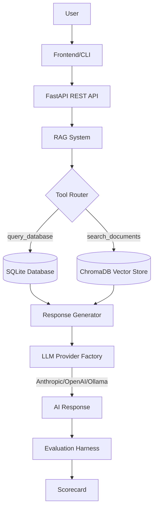
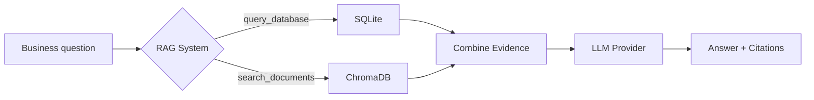

# Poolula Platform — Technical README
**Last Updated: 2026-01-07**

This README explains how to install, run, extend, and evaluate the Poolula Platform as a developer or technical collaborator. It includes system architecture, data models, document flows, chatbot logic, and extensibility guidelines.

For a business-level overview, see **EXECUTIVE_SUMMARY.md**.
For detailed developer documentation, see **CLAUDE.md** and `docs/` (MkDocs site).

---

# 1. System Overview

The Poolula Platform is a unified management platform for Poolula LLC operations, combining:

1. **Structured Data Layer** (SQLModel with SQLite/PostgreSQL)
   - 5 core tables: Properties, Transactions, Documents, Obligations, Audit Log
   - Full provenance tracking for data lineage

2. **Document Management Layer** (ChromaDB vector store)
   - Semantic search over business documents (PDFs)
   - Duplicate detection via SHA-256 content hashing

3. **AI-Powered Chatbot** (RAG pipeline with multi-provider LLM support)
   - Provider-agnostic architecture (Anthropic Claude, OpenAI, Ollama)
   - Database query tool + document search tools
   - Conversation history and audit logging

4. **Evaluation Framework** (Quality assurance)
   - General business evaluator (5 questions)
   - Airbnb income evaluator (15 questions with CSV ground truth)
   - Multi-dimensional scoring (≥90% target)

Each layer is modular, testable, and extensible.

---

# 2. Architecture Diagram (High-Level)



---

# 3. Structured Data Models

The core domain models include:

- **Property**  
- **Transaction** (income, expense, improvement, transfer, etc.)  
- **Obligation** (insurance, compliance, renewals)  

Each model includes:
- SQLModel schema  
- CRUD operations  
- Validation rules  
- Example seeds  

---

# 4. Document Management

All documents are:
- Uploaded as PDFs  
- Normalized  
- Parsed for metadata  
- Classified by type (Agreement, Filing, Insurance, Lease…)  
- Searchable for RAG retrieval  

Future extensions include:
- Embedding search  
- Version history  
- Document lineage tracking  

---

# 5. Chatbot Architecture (RAG)

The chatbot uses a **provider-agnostic architecture** with tool-calling support:

**LLM Providers** (configured via `LLM_PROVIDER` env variable):
- **Anthropic Claude** (default) - Claude Sonnet 4.5
- **OpenAI** - GPT-4o, o1 series
- **Ollama** - Local models for offline/privacy use

**Tool Functions**:
- `query_database` - SQL queries against structured data (SELECT-only for safety)
- `search_document_content` - Semantic search via ChromaDB embeddings
- `list_business_documents` - Document metadata browsing

**Key Features**:
- Conversation history and session management
- Audit logging for all interactions
- Source citation rendering (database + documents)
- Caching for performance

Diagram:



---

# 6. Evaluation Framework (Technical Details)

The platform includes **two specialized evaluators**:

### General Business Evaluator
**Script**: `scripts/evaluate_chatbot.py`
**Dataset**: 5 cross-domain business questions
**Scoring**:
- 40% Tool Choice (correct database vs document search)
- 40% Content Relevance (keyword matching)
- 10% Error Handling
- 10% Completeness

### Airbnb Income Evaluator
**Script**: `scripts/evaluate_airbnb.py`
**Dataset**: 15 rental income questions with CSV ground truth
**Scoring**:
- 50% Numerical Accuracy (validates against source CSV with 1% tolerance)
- 30% Tool Usage (must query database)
- 20% Content Relevance

**Key Features**:
- Ground truth validation (accrual accounting, checkout date revenue recognition)
- Multi-provider comparison (Anthropic vs OpenAI vs Ollama)
- Automated scoring with ≥90% target
- Export to PDF reports  

---

# 7. Current Limitations

- **API Routes**: Only Properties and Chat endpoints exposed (Transactions, Documents, Obligations access via chatbot only)
- **DSPy Integration**: Scaffolding exists but current implementation is a RAG wrapper (true pipeline planned)
- **Test Coverage**: Core components tested but <80% coverage in some modules
- **Evaluation**: Limited to 20 total questions (5 general + 15 Airbnb)
- **Security**: API lacks authentication/authorization (designed for single-user deployment)  

---

# 8. Extending the System

### Add a New Transaction Category
1. Update model enum  
2. Add migration  
3. Add example seeds  
4. Add evaluation questions targeting it  

### Add a New Document Type
1. Add classifier tag  
2. Update document metadata schema  
3. Add retrieval tests  
4. Add evaluation questions  

### Add Chatbot Capabilities
1. Add a new tool function  
2. Add evaluation cases  
3. Update RAG routing logic  
4. Add unit tests  

---

# 9. Development Setup

### Prerequisites
- Python 3.13+
- `uv` package manager ([installation](https://github.com/astral-sh/uv))
- Anthropic API key (for chatbot features)

### Installation

```bash
# Clone repository
git clone https://github.com/dagny099/poolula-platform.git
cd poolula-platform

# Install dependencies (core + dev)
uv sync

# Install with AI/RAG support
uv sync --group rag

# Run database migrations
.venv/bin/alembic upgrade head

# Seed database from YAML
uv run python scripts/seed_database.py --initial

# Start API server
uv run uvicorn apps.api.main:app --reload --port 8082
```

### Environment Variables

Create a `.env` file:

```env
# Database
DATABASE_URL=sqlite:///./poolula.db

# LLM Provider (anthropic, openai, or ollama)
LLM_PROVIDER=anthropic
ANTHROPIC_API_KEY=sk-ant-...

# Optional: OpenAI
# OPENAI_API_KEY=sk-...

# Optional: Ollama (local models)
# OLLAMA_BASE_URL=http://localhost:11434
```

See `docs/workflows/llm-provider-setup.md` for detailed configuration.

---

# 10. Roadmap (Technical)

**Current Focus: Phase 6-7 (DSPy/MLflow Integration)**

See `docs/planning/dspy-mlflow-plan-2025-12-09.md` for detailed roadmap.

**Now (Phase 6-7)**
- Implement true DSPy pipeline (retriever/reasoner/verifier modules)
- MLflow experiment tracking and model registry
- Cross-provider optimization and comparison

**Next (Phase 4-5)**
- Complete API routes (transactions, documents, obligations REST endpoints)
- Expand evaluation datasets (40+ questions)
- Improve test coverage (≥80% target)
- Production hardening (authentication, field protection, PostgreSQL migration)

**Later**
- Advanced analytics and reporting dashboard
- Multi-property portfolio analysis
- Automated tax-year summaries and compliance reports
- Document lineage tracking and version control  

---

# 11. Contributing

Pull requests welcome.  
Before contributing, review:

- Code style  
- Test structure  
- RAG tools  
- Evaluation harness scripts  

---

# 12. License  
Internal prototype — not licensed for distribution.

