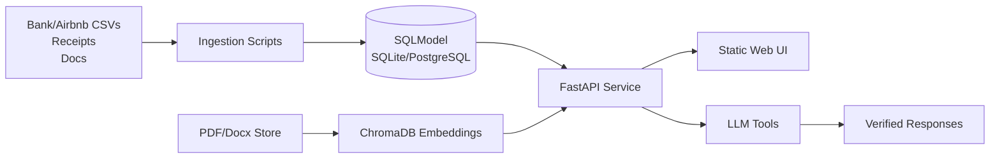
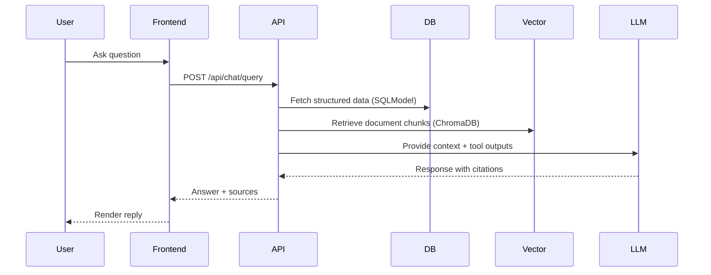

# Poolula Platform

A data hub and natural language query system for Poolula LLC, a Colorado single-member LLC operating rental properties.

## Project Goals

### Short-Term (Current Phase)
- **Transaction Analysis**: Automated categorization and querying of rental income, expenses, and capital transactions (Level 1 analysis with basic Level 2 aggregations)
- **LLC Compliance Q&A**: AI-powered assistant for answering questions about formation documents, operating agreements, insurance policies, leases, and tax obligations
- **Verification System**: Rigorous evaluation harness to validate AI responses against known correct answers (target: ≥90% accuracy)

### Long-Term Vision
Build a consolidated document and data hub where business questions get verifiable answers through:
- Natural language queries over structured transaction data and unstructured documents
- Automated transaction import from sources (Airbnb, bank statements, expense receipts)
- Compliance obligation tracking with document-backed answers
- **NOT** reinventing accounting software - focus on question answering and verification

## Core Business Models

The system models five primary entities:

1. **Property** (`core/database/models.py:Property`)
   - Rental properties with acquisition details, basis calculations, and depreciation tracking
   - Fields: address, acquisition_date, purchase_price_total, land_basis, building_basis, ffe_basis, placed_in_service, status
   - Computed: total_basis, depreciable_basis

2. **Transaction** (`core/database/models.py:Transaction`)
   - Financial events with full provenance tracking
   - Fields: property_id, transaction_date, amount, category, transaction_type, description, source_account
   - Categories: RENTAL_INCOME, UTILITIES_GAS, REPAIRS_MAINTENANCE, PROPERTY_MANAGEMENT, etc. (30+ categories)
   - Types: REVENUE, EXPENSE, CAPITAL, MEMBER_TRANSACTION

3. **Document** (`core/database/models.py:Document`)
   - Business documents with metadata and vector embeddings for semantic search
   - Fields: property_id, filename, doc_type, effective_date, version, confidentiality, storage_path
   - Types: Formation, Operating Agreement, Lease, Insurance, Tax Document, Bank Statement, etc.

4. **Obligation** (`core/database/models.py:Obligation`)
   - Compliance and operational deadlines
   - Fields: property_id, obligation_type, due_date, status, description, recurrence
   - Computed: is_overdue, days_until_due

5. **Provenance** (`core/database/models.py:Provenance`)
   - Data lineage tracking for all transactions
   - Fields: transaction_id, source_type, source_id, confidence, notes
   - Sources: MANUAL_ENTRY, CSV_IMPORT, AIRBNB_EXPORT, BANK_STATEMENT, etc.

## API Endpoints

### Core REST API (`apps/api/main.py`)

**Base URL**: `http://localhost:8082/api/v1`

#### Properties
- `GET /properties` - List all properties with optional filters
- `GET /properties/{property_id}` - Get property details
- `POST /properties` - Create new property
- `PUT /properties/{property_id}` - Update property
- `DELETE /properties/{property_id}` - Soft delete property

#### Transactions
- `GET /transactions` - List transactions with filters (property, date range, category, type)
- `GET /transactions/{transaction_id}` - Get transaction details
- `POST /transactions` - Create transaction
- `PUT /transactions/{transaction_id}` - Update transaction
- `DELETE /transactions/{transaction_id}` - Soft delete transaction

#### Documents
- `GET /documents` - List documents with filters
- `GET /documents/{document_id}` - Get document metadata
- `POST /documents` - Upload document with metadata
- `DELETE /documents/{document_id}` - Soft delete document

#### Obligations
- `GET /obligations` - List obligations with filters (due_date, status)
- `GET /obligations/{obligation_id}` - Get obligation details
- `POST /obligations` - Create obligation
- `PUT /obligations/{obligation_id}` - Update obligation
- `DELETE /obligations/{obligation_id}` - Soft delete obligation

#### Chatbot
- `POST /chat/query` - Send natural language query, get AI response with sources
  - Request: `{"query": "What was my rental income in August 2025?", "session_id": "optional-uuid"}`
  - Response: `{"response": "...", "sources": [...], "session_id": "..."}`

#### System
- `GET /health` - Health check endpoint
- `GET /docs` - Interactive API documentation (Swagger UI)

## System Dataflow
A data hub and AI-assisted query layer for Poolula LLC rental operations, combining transaction tracking, document search, and compliance reminders behind a FastAPI service and lightweight web UI.

```
┌─────────────────┐
│ Data Sources    │
│ - Airbnb CSV    │──┐
│ - Bank Stmt     │  │
│ - Manual Entry  │  │  Import Scripts
│ - Expense CSV   │  │  (scripts/)
└─────────────────┘  │
                     ▼
                ┌─────────────┐
                │  Database   │
                │  (SQLite)   │◄──── Migrations (alembic/)
                │             │
                │ 5 Tables:   │
                │ - Property  │
                │ - Transaction
                │ - Document  │
                │ - Obligation│
                │ - Provenance│
                └──────┬──────┘
                       │
                       ▼
            ┌──────────────────────┐
            │   FastAPI Service    │
            │   (apps/api/)        │
            └─────────┬────────────┘
                      │
        ┌─────────────┼─────────────┐
        ▼             ▼             ▼
  ┌──────────┐  ┌──────────┐  ┌──────────┐
  │ Chatbot  │  │Frontend  │  │  Scripts │
  │ RAG      │  │(Vanilla  │  │  (CLI)   │
  │ System   │  │   JS)    │  │          │
  └────┬─────┘  └──────────┘  └──────────┘
       │
       ├──► Database Query Tool
       │    (SQL SELECT-only, structured data)
       │
       └──► Document Search Tool
            (ChromaDB vector search, semantic queries)

User Query: "What was my rental income in August 2025?"
    ↓
AI determines tools needed (query_database)
    ↓
Execute: query_database(query_type="aggregate_transactions",
                        filters={category: "RENTAL_INCOME",
                                transaction_type: "REVENUE",
                                start_date: "2025-08-01",
                                end_date: "2025-08-31"})
    ↓
Returns: {"success": true, "count": 12, "total_amount": "16144.12", ...}
    ↓
AI synthesizes answer: "Your rental income in August 2025 was $16,144.12
                        from 12 transactions."
    ↓
Audit log records: query, response, sources, timestamp
```

## Technology Stack

**Backend:**
- Python 3.13+ (`uv` package manager)
- FastAPI (REST API)
- SQLModel (SQLAlchemy + Pydantic ORM)
- SQLite database (single file: `poolula.db`)
- ChromaDB (vector store for document embeddings)
- Anthropic Claude API (Sonnet 4.5 model)
- Alembic (database migrations)

**Frontend:**
- Vanilla JavaScript (no framework)
- HTML5 + CSS3
- Marked.js (markdown rendering)
- 4 persona-based help sections (New LLC Owner, Bookkeeper, Property Manager, Compliance Officer)

**Testing & Quality:**
- pytest (test framework)
- Coverage target: ≥80%
- Evaluation harness with golden question set (target: ≥90% AI accuracy)

**Documentation:**
- MkDocs with Material theme
- Inline code documentation
- Workflow guides
   

## Repository Structure
## Table of Contents
- [🚀 Quick Start](#-quick-start)
- [🧭 Project Overview](#-project-overview)
- [✨ Features](#-features)
- [📁 Repository Structure](#-repository-structure)
- [⚙️ How It Works](#️-how-it-works)
- [🔧 Configuration & Environment](#-configuration--environment)
- [🖥️ Examples & Demos](#️-examples--demos)
- [🧪 Development Guide](#-development-guide)
- [🧰 Tech Stack](#-tech-stack)
- [🛣️ Roadmap](#️-roadmap)
- [🤝 Contributing](#-contributing)
- [📜 License](#-license)

```
poolula-platform/
├── README.md                    # This file
├── pyproject.toml              # Python dependencies (uv managed)
├── .env.example                # Environment variable template
├── .gitignore                  # Ignore .env, *.db, uploads/, logs/, etc.
│
├── core/                       # Platform foundation
│   ├── database/
│   │   ├── connection.py       # Database engine and session management
│   │   ├── models.py           # SQLModel definitions (5 core models)
│   │   └── enums.py            # Transaction categories, types, statuses
│   ├── logging_config.py       # Centralized logging setup
│   └── config.py               # Settings (from environment variables)
│
├── apps/                       # Feature modules
│   ├── api/
│   │   ├── main.py             # FastAPI application
│   │   └── routes/             # Endpoint definitions
│   ├── chatbot/
│   │   ├── ai_generator.py     # Claude API integration
│   │   ├── database_tool.py    # SQL query tool (SELECT-only)
│   │   ├── document_tool.py    # ChromaDB document search
│   │   ├── vector_store.py     # Document embedding and retrieval
│   │   └── tool_manager.py     # Tool execution orchestration
│   └── evaluator/
│       ├── evaluation_harness.py   # Golden question testing
│       └── poolula_eval_set.jsonl  # Evaluation questions and answers
│
├── alembic/                    # Database migrations
│   ├── versions/               # Migration scripts
│   └── env.py                  # Alembic configuration
│
├── scripts/                    # Utility scripts
│   ├── cli.py                  # Interactive chatbot CLI
│   ├── seed_database.py        # Initialize database from YAML
│   ├── import_airbnb_transactions.py   # Import Airbnb CSV exports
│   ├── remove_duplicate_transactions.py # Data cleanup
│   └── backup.py               # Database backup script
│
├── data/                       # Data files (see .gitignore)
│   ├── templates/              # Template files (git tracked)
│   │   ├── airbnb_template.csv
│   │   └── expenses_template.csv
│   ├── poolula_facts.yml       # Seed data for properties (git tracked)
│   └── [user data files not tracked - see .gitignore]
│
├── documents/                  # Business documents (not git tracked)
│   ├── formation/              # LLC formation documents
│   ├── insurance/              # Insurance policies
│   ├── leases/                 # Lease agreements
│   ├── tax/                    # Tax documents
│   └── [other document types]
│
├── tests/                      # Test suite (pytest)
│   ├── test_models.py          # Model validation tests
│   ├── test_api.py             # API endpoint tests
│   ├── test_chatbot.py         # Chatbot integration tests
│   └── test_evaluation.py      # Evaluation harness tests
│
├── docs/                       # Documentation (MkDocs)
│   ├── architecture/           # System design documentation
│   ├── workflows/              # Task-oriented guides
│   └── planning/               # Implementation plans and decisions
│
└── frontend/                   # Web interface
    ├── index.html              # Main chat interface
    ├── styles.css              # Styling
    └── script.js               # Client-side logic
```

## Quick Start

### Prerequisites
- Python 3.13+
- `uv` package manager: `pip install uv` or `brew install uv`
- Anthropic API key: Sign up at https://console.anthropic.com/
## 🚀 Quick Start

### Installation
Set up the platform locally in minutes.

```bash
# 1. Clone repository
cd /path/to/poolula-platform
# 1) Clone
git clone https://github.com/yourusername/poolula-platform.git
cd poolula-platform

# 2. Install dependencies
# 2) Install dependencies (uses uv)
curl -LsSf https://astral.sh/uv/install.sh | sh
uv sync

# 3. Set up environment variables
cp .env.example .env
# Edit .env and set ANTHROPIC_API_KEY=your-key-here

# 4. Run database migrations
# 3) Apply database migrations
.venv/bin/alembic upgrade head

# 5. Seed initial data (optional - creates sample property)
# 4) Seed starter data
uv run python scripts/seed_database.py --initial

# 5) Run the API (hot reload)
uv run uvicorn apps.api.main:app --reload --port 8082
```

### Usage
Visit **http://localhost:8082** for the mounted frontend or **/docs** for interactive Swagger UI. Health check:

**Start API server:**
```bash
uv run uvicorn apps.api.main:app --reload --port 8082
# Access: http://localhost:8082
# API docs: http://localhost:8082/docs
curl http://localhost:8082/health
```

**Interactive chatbot CLI:**
```bash
uv run python scripts/cli.py chat
# Ask questions like:
# > What was my rental income in August 2025?
# > List all active properties
# > What are the business formation documents?
## 🧭 Project Overview

Poolula Platform centralizes rental property data, documents, and compliance obligations while exposing:
- **FastAPI REST API** for CRUD over properties, transactions, documents, and obligations.
- **RAG-powered chatbot** (Anthropic/OpenAI providers) for natural-language answers with citations.
- **CLI scripts** for imports, seeding, backups, and document ingestion.



**Import Airbnb transactions:**
```bash
# Preview import (dry run)
uv run python scripts/import_airbnb_transactions.py \
    --csv data/airbnb_export.csv \
    --property-id <uuid> \
    --dry-run

# Actually import
uv run python scripts/import_airbnb_transactions.py \
    --csv data/airbnb_export.csv \
    --property-id <uuid>
## ✨ Features
- Property, transaction, document, and obligation models with provenance + soft delete auditing.
- REST endpoints for CRUD and health checks; swagger docs at `/docs`.
- Chat endpoint (`POST /api/chat/query`) that routes queries through database and document tools.
- CLI toolbox (`scripts/`) for seeding, ingestion, backups, and evaluation harness.
- Configurable database backend (SQLite for dev, PostgreSQL for production).
- Test suite targeting ≥80% coverage with pytest + coverage.

## 📁 Repository Structure

```text
.
├─ apps/                  # Application entry points
│  ├─ api/                # FastAPI app and routers
│  ├─ chatbot/            # RAG pipeline, provider configs
│  └─ evaluator/          # Accuracy evaluation harness
├─ core/                  # Database models, enums, logging, connections
├─ frontend/              # Static UI served by FastAPI
├─ scripts/               # CLI utilities (seed, ingest, backup)
├─ tests/                 # Unit/integration tests
├─ alembic/               # Database migrations
├─ docs/                  # Architecture, workflows, planning docs
├─ pyproject.toml         # Project metadata and tooling config
└─ uv.lock                # Locked dependency versions
```

**Run evaluation:**
```bash
uv run python apps/evaluator/evaluation_harness.py
# Outputs score report to docs/evaluation/
## ⚙️ How It Works

1. **Data sources** (CSV exports, receipts, PDFs) are imported via scripts into SQLModel tables.
2. **FastAPI** exposes CRUD routes; dependency-injected sessions use `core.database.connection` for SQLite/Postgres.
3. **Chatbot** composes tools (SQL queries + document search) and calls Anthropic or OpenAI providers.
4. **Frontend** static bundle is mounted by FastAPI at `/`, consuming the same API and chat endpoints.



### Key Configuration
## 🔧 Configuration & Environment

**Environment Variables** (`.env` file):
- `ANTHROPIC_API_KEY` - Required for chatbot functionality
- `DATABASE_URL` - Database connection (default: `sqlite:///poolula.db`)
- `LOG_LEVEL` - Logging verbosity (default: `INFO`)
Create a `.env` file or set environment variables:

**Database Location**:
- Development: `poolula.db` (SQLite file in project root, NOT git tracked)
- Production: PostgreSQL (connection string in DATABASE_URL)
| Variable | Purpose | Default |
|----------|---------|---------|
| `DATABASE_URL` | Database connection string (SQLite or PostgreSQL) | `sqlite:///./poolula.db` |
| `DEBUG` | Enable verbose SQL logging | `false` |
| `ANTHROPIC_API_KEY` | Required for Anthropic-based chatbot provider | _none_ |
| `OPENAI_API_KEY` | Optional OpenAI provider key | _none_ |

## Development Workflow
- For local development, SQLite is sufficient; production should set `DATABASE_URL` for PostgreSQL.
- Keep API keys in `.env` or a secrets manager—avoid committing secrets to git.

### Common Tasks
## 🖥️ Examples & Demos

### API CRUD
```bash
# Run API server (auto-reload on code changes)
uv run uvicorn apps.api.main:app --reload --port 8082

# Run all tests
uv run pytest

# Run tests with coverage report
uv run pytest --cov=core --cov=apps --cov-report=html
open htmlcov/index.html

# Create database migration
.venv/bin/alembic revision --autogenerate -m "Add new field to Transaction"

# Apply migrations
.venv/bin/alembic upgrade head

# Create database backup
uv run python scripts/backup.py
# Creates: backups/poolula_YYYYMMDD_HHMMSS.db

# Remove duplicate transactions
uv run python scripts/remove_duplicate_transactions.py --dry-run  # Preview
uv run python scripts/remove_duplicate_transactions.py            # Execute
# List properties
curl http://localhost:8082/api/v1/properties

# Create property
curl -X POST http://localhost:8082/api/v1/properties \
  -H "Content-Type: application/json" \
  -d '{
        "address": "900 S 9th St, Montrose, CO 81401",
        "acquisition_date": "2024-04-15",
        "purchase_price_total": "442300.00",
        "land_basis": "78200.00",
        "building_basis": "364100.00",
        "ffe_basis": "10000.00",
        "placed_in_service": "2025-02-01",
        "status": "ACTIVE"
      }'
```

### Adding New Features

**Example: Add new transaction category**

1. Edit `core/database/enums.py`:
   ```python
   class TransactionCategory(str, Enum):
       # ... existing categories ...
       NEW_CATEGORY = "NEW_CATEGORY"  # Add new value
   ```

2. Create migration:
   ```bash
   .venv/bin/alembic revision --autogenerate -m "Add NEW_CATEGORY to TransactionCategory"
   .venv/bin/alembic upgrade head
   ```

3. Update tests in `tests/test_models.py`

4. Update documentation

### Design Patterns

- **Provenance Tracking**: Every transaction records its source (CSV import, manual entry, etc.) via Provenance table
- **Soft Deletes**: Set `deleted_at` timestamp instead of hard DELETE (preserves audit trail)
- **Audit Logging**: All chatbot queries logged to database (query, response, sources, timestamp)
- **Type Safety**: SQLModel provides Pydantic validation + SQLAlchemy ORM
- **No ORMs Within ORMs**: Direct SQLModel usage, no repository pattern (simplicity for single-developer project)

## Testing

**Coverage Target**: ≥80%

### Test Categories

1. **Unit Tests**: Model validation, computed properties, enums
2. **Integration Tests**: API endpoints with full CRUD operations
3. **Chatbot Tests**: Tool execution, multi-round queries, error handling
4. **Evaluation Tests**: Golden question set accuracy

### Running Tests

### Chatbot
```bash
# All tests
uv run pytest

# Specific test file
uv run pytest tests/test_models.py

# Specific test function
uv run pytest tests/test_api.py::test_create_property

# With verbose output
uv run pytest -v

# With coverage
uv run pytest --cov=core --cov=apps --cov-report=term-missing

# Generate HTML coverage report
uv run pytest --cov=core --cov=apps --cov-report=html
open htmlcov/index.html
export ANTHROPIC_API_KEY=sk-ant-...
curl -X POST http://localhost:8082/api/chat/query \
  -H "Content-Type: application/json" \
  -d '{"query": "What was rental income in August 2025?", "session_id": "demo"}'
```

### Evaluation Harness

The evaluation harness tests AI accuracy against known correct answers:

### Document Ingestion
```bash
# Run evaluation
uv run python apps/evaluator/evaluation_harness.py

# Output: docs/evaluation/evaluation_report_YYYYMMDD_HHMMSS.json
# Place PDFs/Docx files into data/documents (or adjust script path)
uv run python scripts/ingest_documents.py --ingest
```

**Scoring Dimensions:**
- Tool usage correctness (did AI use right tools?)
- Content relevance (does answer address the question?)
- Semantic similarity (answer matches expected content)
- Numerical accuracy (financial figures match expected values)
- Citation accuracy (sources are correct and relevant)

**Target Score**: ≥90%

## Documentation

### For Developers
- **CLAUDE.md**: Quick reference for AI coding assistants
- **Implementation Plan**: `docs/planning/implementation-plan-2024-11-14.md`
- **API Reference**: http://localhost:8082/docs (interactive Swagger UI)

### Architecture
- **Business Objects**: `docs/architecture/business-objects.md`
- **Platform Interfaces**: `docs/architecture/platform-interfaces.md`
- **Quick Reference**: `docs/architecture/quick-reference.md`

### Workflow Guides
- **Data Import**: `docs/workflows/data-import.md`
- **API Usage**: `docs/workflows/api-usage.md`
- **Testing**: `docs/workflows/testing.md`

### Code Documentation
- Database models: See `core/database/models.py` (inline docstrings)
- API endpoints: See `apps/api/routes/` (inline docstrings)
- Enums: See `core/database/enums.py` (30+ transaction categories)

## Current Status

**Phase**: Week 0 - README revision and approval


**Completed**:
- ✅ Database schema (5 tables: Property, Transaction, Document, Obligation, Provenance)
- ✅ SQLModel models with provenance tracking
- ✅ Alembic migrations
- ✅ FastAPI REST API (properties, transactions, documents, obligations endpoints)
- ✅ Database query tool for chatbot (SELECT-only, safe queries)
- ✅ RAG system integration (database + document search)
- ✅ Chatbot CLI with source citations
- ✅ Airbnb CSV import script with accrual accounting
- ✅ Duplicate transaction removal script
- ✅ Evaluation harness with 15 golden questions
- ✅ Comprehensive test suite (31/37 tests passing, ≥80% coverage)
- ✅ Audit logging for all chatbot interactions
## 🧪 Development Guide

**Next Steps** (pending README approval):
- Fix ChromaDB document search bug
- Re-ingest LLC documents (formation, insurance, leases, tax)
- Port vanilla JS frontend with 4 persona sections
- Expand evaluation set (15 → 40 questions)
- Improve evaluation metrics (semantic similarity, numerical accuracy)
- Build evaluation reporting dashboard
- Achieve ≥90% evaluation score
- **Run server:** `uv run uvicorn apps.api.main:app --reload --port 8082`
- **Tests:** `uv run pytest` (coverage enabled via pyproject)
- **Lint/format:** `uv run ruff check .`
- **Type check:** `uv run mypy .`
- **Migrations:** `.venv/bin/alembic upgrade head` (create with `alembic revision --autogenerate`)
- **Seed data:** `uv run python scripts/seed_database.py --initial`

See `docs/planning/implementation-plan-2024-11-14.md` for detailed 3-week plan.
## 🧰 Tech Stack

## Contributing
| Layer | Technology | Purpose |
|-------|------------|---------|
| Backend | FastAPI + SQLModel | REST API and ORM models |
| Data | SQLite (dev) / PostgreSQL (prod) | Transaction & document metadata storage |
| AI/RAG | Anthropic / OpenAI, ChromaDB | Natural language answers with citations |
| Frontend | Static HTML/JS | Lightweight UI served by FastAPI |
| Tooling | uv, pytest, ruff, mypy, Alembic | Dependency mgmt, testing, linting, typing, migrations |

This is a solo-developer project for Poolula LLC. Architectural decisions are documented in `docs/architecture/` with rationale.
## 🛣️ Roadmap
- Fix ChromaDB document search issue and re-ingest LLC documents.
- Expand evaluation set and improve scoring to ≥90%.
- Port richer frontend with personas and reporting dashboards.
- Add PostgreSQL-first deployment path and containerized dev setup.

## License
## 🤝 Contributing

Proprietary - Internal use only for Poolula LLC operations.
Contributions are welcome—open issues or submit PRs. See `docs/` for architecture notes and workflows before proposing changes.

---
## 📜 License

**Last Updated**: 2024-11-14
**Status**: Week 0 - Foundation complete, awaiting README approval to proceed
No public license is specified; assume internal use unless a `LICENSE` file is added.