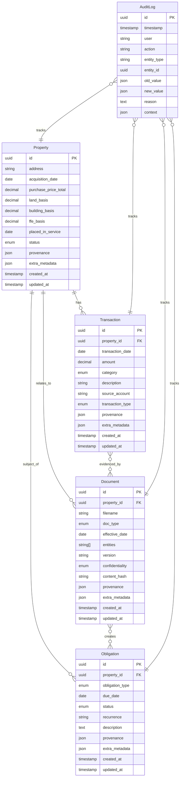
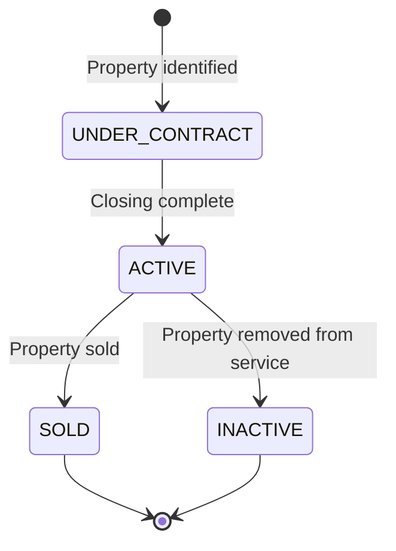
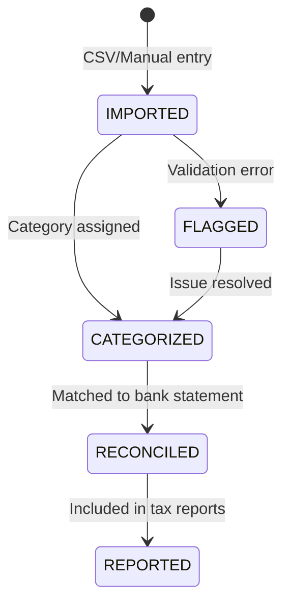
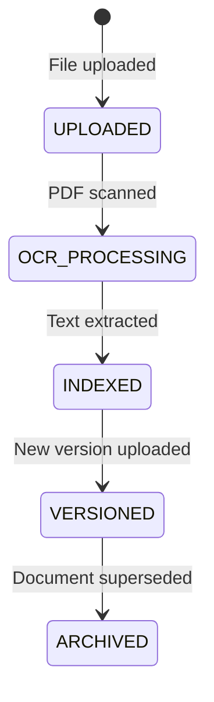
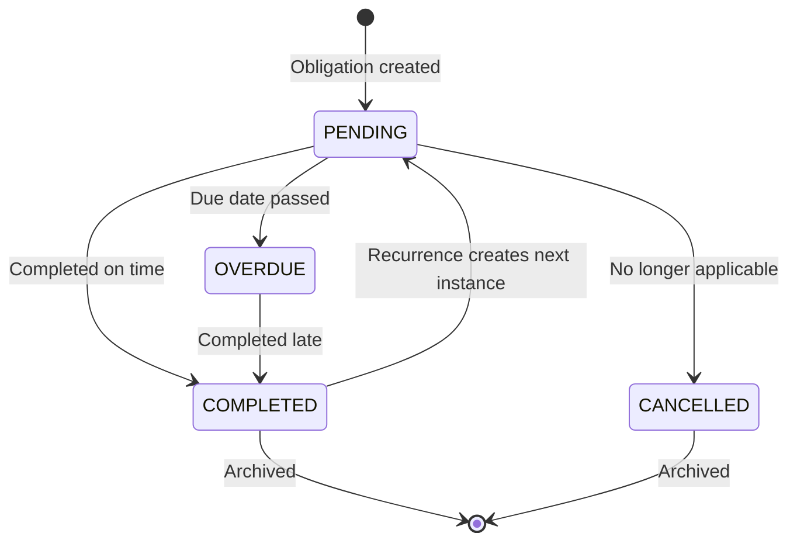

# Business Objects Reference

**Complete guide to Poolula Platform's core business objects**

---

## Overview

Poolula Platform models the operations of Poolula LLC through five core business objects. Each object represents a real-world concept and includes built-in provenance tracking for transparency.

**The Five Core Objects:**

1. **Property** - Rental properties owned by the LLC
2. **Transaction** - Financial events (revenue, expenses, capital)
3. **Document** - Legal and operational documents
4. **Obligation** - Compliance and operational deadlines
5. **AuditLog** - Immutable change history

---

## Entity Relationship Diagram



---

## 1. Property

**Purpose**: Represents a rental property owned by Poolula LLC

### Key Fields

| Field | Type | Required | Description |
|-------|------|----------|-------------|
| `id` | UUID | Yes | Unique identifier (auto-generated) |
| `address` | String | Yes | Physical address of the property |
| `acquisition_date` | Date | Yes | Date property was acquired |
| `purchase_price_total` | Decimal | Yes | Total purchase price |
| `land_basis` | Decimal | Yes | Basis allocated to land (non-depreciable) |
| `building_basis` | Decimal | Yes | Basis allocated to building (depreciable) |
| `ffe_basis` | Decimal | No | Basis allocated to furniture/fixtures/equipment |
| `placed_in_service` | Date | No | Date property was placed in service for depreciation |
| `status` | Enum | Yes | Current status (ACTIVE, UNDER_CONTRACT, SOLD, INACTIVE) |
| `provenance` | JSON | Yes | Data lineage and source information |
| `extra_metadata` | JSON | No | Additional property-specific data |

### Computed Properties

```python
@property
def total_basis(self) -> Decimal:
    """Sum of all basis components"""
    return self.land_basis + self.building_basis + self.ffe_basis

@property
def depreciable_basis(self) -> Decimal:
    """Only building and FFE (land is not depreciable)"""
    return self.building_basis + self.ffe_basis
```

### Lifecycle States



### Relationships

- **HAS MANY** Transactions (revenue, expenses tied to property)
- **HAS MANY** Documents (deeds, leases, inspection reports)
- **HAS MANY** Obligations (property taxes, insurance renewals)

### Example

```json
{
  "id": "12345678-1234-1234-1234-123456789012",
  "address": "900 S 9th St, Montrose, CO 81401",
  "acquisition_date": "2024-04-15",
  "purchase_price_total": "442300.00",
  "land_basis": "78200.00",
  "building_basis": "364100.00",
  "ffe_basis": "10000.00",
  "placed_in_service": "2025-02-01",
  "status": "ACTIVE",
  "provenance": {
    "source_type": "manual_entry",
    "source_id": "poolula_facts.yml",
    "confidence": 1.0,
    "verification_status": "verified"
  },
  "created_at": "2025-11-13T10:00:00",
  "updated_at": "2025-11-13T10:00:00"
}
```

---

## 2. Transaction

**Purpose**: Financial events (revenue, expenses, capital contributions/distributions)

### Key Fields

| Field | Type | Required | Description |
|-------|------|----------|-------------|
| `id` | UUID | Yes | Unique identifier |
| `property_id` | UUID | No | Associated property (null for LLC-level) |
| `transaction_date` | Date | Yes | Date transaction occurred |
| `amount` | Decimal | Yes | Transaction amount (always positive) |
| `category` | Enum | Yes | Chart of accounts category |
| `description` | String | Yes | Human-readable description |
| `source_account` | String | No | Bank account or source |
| `transaction_type` | Enum | Yes | REVENUE, EXPENSE, CAPITAL_CONTRIBUTION, CAPITAL_DISTRIBUTION |
| `provenance` | JSON | Yes | Source of transaction data |

### Transaction Categories (Chart of Accounts)

**Revenue:**
- `RENTAL_INCOME` - Rental revenue from tenants

**Operating Expenses:**
- `UTILITIES_GAS`, `UTILITIES_WATER`, `UTILITIES_ELECTRIC`, `UTILITIES_INTERNET`
- `REPAIRS_MAINTENANCE` - Ongoing maintenance and repairs
- `INSURANCE` - Property insurance premiums
- `PROPERTY_TAXES` - Annual property tax
- `PROPERTY_MANAGEMENT` - Management fees
- `BANK_FEES` - Banking and transaction fees
- `PROFESSIONAL_FEES` - CPA, attorney, consultant fees

**Capital:**
- `CAPITAL_IMPROVEMENT` - Improvements that increase basis
- `FURNITURE_FIXTURES` - FFE purchases
- `BASIS_ADJUSTMENT` - Corrections to depreciable basis

**Member Transactions:**
- `MEMBER_CONTRIBUTION` - Capital contributed to LLC
- `MEMBER_DISTRIBUTION` - Distributions to member

**Other:**
- `UNCATEGORIZED` - Transactions not yet categorized

### Validation Rules

```python
def validate_amount(self) -> None:
    """Amount must be positive (use transaction_type for direction)"""
    if self.amount <= 0:
        raise ValueError("Transaction amount must be positive")

def validate_category_type_match(self) -> None:
    """Category must match transaction_type"""
    # Example: RENTAL_INCOME must be REVENUE type
    # UTILITIES_GAS must be EXPENSE type
```

### Lifecycle



### Relationships

- **BELONGS TO** Property (nullable - some transactions are LLC-level)
- **EVIDENCED BY** Documents (receipts, invoices, bank statements)
- **TRACKED BY** AuditLog entries

### Example

```json
{
  "id": "22222222-2222-2222-2222-222222222222",
  "property_id": "12345678-1234-1234-1234-123456789012",
  "transaction_date": "2024-11-01",
  "amount": "1500.00",
  "category": "RENTAL_INCOME",
  "description": "November 2024 rental income",
  "source_account": "Chase Business Checking",
  "transaction_type": "REVENUE",
  "provenance": {
    "source_type": "csv_import",
    "source_id": "airbnb_nov_2024.csv",
    "source_field": "row_15",
    "confidence": 1.0
  }
}
```

---

## 3. Document

**Purpose**: Legal and operational documents with metadata and provenance

### Key Fields

| Field | Type | Required | Description |
|-------|------|----------|-------------|
| `id` | UUID | Yes | Unique identifier |
| `property_id` | UUID | No | Associated property (nullable for LLC docs) |
| `filename` | String | Yes | Original filename |
| `doc_type` | Enum | Yes | Document category |
| `effective_date` | Date | No | Date document becomes effective |
| `entities` | String[] | No | Legal entities involved (validated format) |
| `version` | String | No | Version identifier (e.g., "v2", "2024-11-13") |
| `confidentiality` | Enum | Yes | PUBLIC, INTERNAL, CONFIDENTIAL, RESTRICTED |
| `content_hash` | String | Yes | SHA-256 hash for integrity verification |

### Document Types

```python
class DocumentType(str, Enum):
    DEED = "deed"
    LEASE = "lease"
    OPERATING_AGREEMENT = "operating_agreement"
    AMENDMENT = "amendment"
    INVOICE = "invoice"
    RECEIPT = "receipt"
    BANK_STATEMENT = "bank_statement"
    TAX_RETURN = "tax_return"
    INSPECTION_REPORT = "inspection_report"
    APPRAISAL = "appraisal"
    INSURANCE_POLICY = "insurance_policy"
    CONTRACT = "contract"
    OTHER = "other"
```

### Entity Name Validation

Entities must be standardized legal names:
- "Poolula LLC" (not "poolula" or "Poolula")
- "Hidalgo-Sotelo Living Trust" (exact format)
- Property addresses must match Property.address exactly

### Lifecycle



### Relationships

- **BELONGS TO** Property (nullable)
- **EVIDENCES** Transactions (invoice → expense)
- **CREATES** Obligations (lease → rent due dates)

### Example

```json
{
  "id": "33333333-3333-3333-3333-333333333333",
  "property_id": "12345678-1234-1234-1234-123456789012",
  "filename": "900_s_9th_lease_2024.pdf",
  "doc_type": "LEASE",
  "effective_date": "2024-02-01",
  "entities": ["Poolula LLC", "Tenant Name"],
  "version": "v1",
  "confidentiality": "CONFIDENTIAL",
  "content_hash": "a1b2c3d4e5f6...",
  "provenance": {
    "source_type": "manual_upload",
    "uploaded_by": "trustee",
    "confidence": 1.0
  }
}
```

---

## 4. Obligation

**Purpose**: Compliance deadlines and recurring operational tasks

### Key Fields

| Field | Type | Required | Description |
|-------|------|----------|-------------|
| `id` | UUID | Yes | Unique identifier |
| `property_id` | UUID | No | Associated property (nullable for LLC obligations) |
| `obligation_type` | Enum | Yes | Type of obligation |
| `due_date` | Date | Yes | Next due date |
| `status` | Enum | Yes | PENDING, COMPLETED, OVERDUE, CANCELLED |
| `recurrence` | String | No | RRULE format for recurring obligations |
| `description` | Text | Yes | Details about the obligation |

### Obligation Types

```python
class ObligationType(str, Enum):
    PROPERTY_TAX = "property_tax"
    INSURANCE_RENEWAL = "insurance_renewal"
    LLC_ANNUAL_REPORT = "llc_annual_report"
    TAX_FILING = "tax_filing"
    LEASE_RENEWAL = "lease_renewal"
    INSPECTION = "inspection"
    MAINTENANCE_SCHEDULED = "maintenance_scheduled"
    COMPLIANCE_FILING = "compliance_filing"
    OTHER = "other"
```

### Recurrence (RRULE Format)

Uses [iCalendar RRULE standard](https://icalendar.org/iCalendar-RFC-5545/3-8-5-3-recurrence-rule.html):

```python
# Annual property tax (every April 30)
recurrence = "FREQ=YEARLY;BYMONTH=4;BYMONTHDAY=30"

# Quarterly estimated taxes (April 15, June 15, Sept 15, Jan 15)
recurrence = "FREQ=YEARLY;BYMONTH=4,6,9,1;BYMONTHDAY=15"

# Monthly rent due (1st of each month)
recurrence = "FREQ=MONTHLY;BYMONTHDAY=1"
```

### Lifecycle



### Relationships

- **BELONGS TO** Property (nullable)
- **CREATED BY** Documents (lease → rent obligations)
- **TRACKED BY** AuditLog entries

### Example

```json
{
  "id": "44444444-4444-4444-4444-444444444444",
  "property_id": "12345678-1234-1234-1234-123456789012",
  "obligation_type": "PROPERTY_TAX",
  "due_date": "2025-04-30",
  "status": "PENDING",
  "recurrence": "FREQ=YEARLY;BYMONTH=4;BYMONTHDAY=30",
  "description": "Annual property tax payment to Montrose County",
  "provenance": {
    "source_type": "manual_entry",
    "created_by": "trustee",
    "confidence": 1.0
  }
}
```

---

## 5. AuditLog

**Purpose**: Immutable record of all changes to business objects

### Key Fields

| Field | Type | Required | Description |
|-------|------|----------|-------------|
| `id` | UUID | Yes | Unique identifier |
| `timestamp` | DateTime | Yes | When change occurred |
| `user` | String | Yes | Who made the change (user ID or "system") |
| `action` | String | Yes | CREATE, UPDATE, DELETE, etc. |
| `entity_type` | String | Yes | Property, Transaction, Document, Obligation |
| `entity_id` | UUID | Yes | ID of the changed entity |
| `old_value` | JSON | No | Previous state (null for CREATE) |
| `new_value` | JSON | No | New state (null for DELETE) |
| `reason` | Text | No | Why the change was made |
| `context` | JSON | No | Additional context (IP address, request ID, etc.) |

### Actions Tracked

- `CREATE` - New entity created
- `UPDATE` - Entity modified
- `DELETE` - Entity soft-deleted
- `RESTORE` - Entity undeleted
- `IMPORT` - Batch import operation
- `EXPORT` - Data exported
- `LOGIN` - User authentication (future)
- `QUERY` - Sensitive data accessed (future)

### Immutability

**Critical**: AuditLog entries are NEVER modified or deleted. They provide a permanent record.

```python
# NO UPDATE OR DELETE METHODS
# Only INSERT allowed
```

### Example

```json
{
  "id": "55555555-5555-5555-5555-555555555555",
  "timestamp": "2025-11-13T14:30:00.000000",
  "user": "system:seed_script",
  "action": "CREATE",
  "entity_type": "Property",
  "entity_id": "12345678-1234-1234-1234-123456789012",
  "old_value": null,
  "new_value": {
    "address": "900 S 9th St, Montrose, CO 81401",
    "acquisition_date": "2024-04-15",
    "purchase_price_total": "442300.00"
  },
  "reason": "Initial data import from poolula_facts.yml",
  "context": {
    "script_version": "1.0.0",
    "source_file": "poolula_facts.yml"
  }
}
```

---

## Common Patterns

### Provenance Structure

All business objects (except AuditLog) include provenance:

```json
{
  "source_type": "csv_import | manual_entry | api_call | system_generated",
  "source_id": "filename.csv | user_id | request_id",
  "source_field": "row_15 | cell_B3 | null",
  "created_at": "2025-11-13T10:00:00Z",
  "created_by": "system:importer | user_id",
  "confidence": 1.0,
  "verification_status": "unverified | verified | needs_review",
  "notes": "Additional context about data origin"
}
```

### Metadata Flexibility

The `extra_metadata` field allows storing domain-specific data:

```json
// Property metadata
{
  "square_footage": 1200,
  "bedrooms": 2,
  "bathrooms": 1.5,
  "parcel_number": "12345-67-890"
}

// Transaction metadata
{
  "check_number": "1234",
  "cleared_date": "2024-11-05",
  "reconciliation_status": "matched"
}
```

---

## Data Integrity Rules

### UUID Primary Keys

All entities use UUID primary keys (not auto-incrementing integers):
- Globally unique
- Portable across databases
- No collision risk in distributed systems

### Soft Deletes

Entities are never hard-deleted:
- Set `status = INACTIVE` instead of DELETE
- Maintain referential integrity
- Enable audit trail

### Decimal for Money

All monetary amounts use `Decimal` type (not float):
- Exact precision (no rounding errors)
- Stored as NUMERIC in database
- String representation in JSON ("442300.00")

### Timestamps

All mutable entities include:
- `created_at` - When record was created (never changes)
- `updated_at` - Last modification time (auto-updated)

---

## Next Steps

- **Platform Interfaces**: See [platform-interfaces.md](platform-interfaces.md) for how to interact with these objects
- **Quick Reference**: See [quick-reference.md](quick-reference.md) for common operations cheat sheet
- **API Documentation**: See http://localhost:8082/docs for interactive API docs
- **Data Model Code**: See `core/database/models.py` for SQLModel implementations
