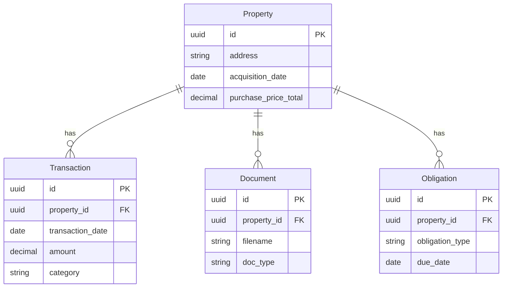

# Data Models

Detailed database schema and model documentation for Poolula Platform.

## Overview

Poolula Platform uses SQLModel (SQLAlchemy + Pydantic) for type-safe database models. The database schema consists of 5 core tables with UUID primary keys and embedded provenance tracking.

## Core Tables

### Properties

Rental property records with acquisition details, cost basis, and depreciation information.

**Table:** `properties`

**Key Fields:**
- `id` (UUID) - Primary key
- `address` (string) - Property address
- `acquisition_date` (date) - Purchase date
- `purchase_price_total` (decimal) - Total purchase price
- `land_basis` (decimal) - Land cost basis
- `building_basis` (decimal) - Building cost basis
- `ffe_basis` (decimal) - Furniture, fixtures & equipment basis
- `placed_in_service` (date) - Depreciation start date
- `status` (enum) - ACTIVE, INACTIVE, SOLD
- `provenance` (JSON) - Source tracking metadata

See: [Business Objects Reference](business-objects.md) for detailed field definitions.

### Transactions

Financial transactions including rental income, expenses, and other financial activity.

**Table:** `transactions`

**Key Fields:**
- `id` (UUID) - Primary key
- `property_id` (UUID) - Foreign key to properties
- `transaction_date` (date) - Transaction date
- `amount` (decimal) - Transaction amount
- `category` (string) - Chart of accounts category
- `transaction_type` (enum) - REVENUE, EXPENSE, TRANSFER
- `description` (string) - Transaction description
- `source_account` (string) - Bank account or payment source

#### Transaction Categories

Revenue categories:
- `revenue:rental_income` - Short-term rental income
- `revenue:long_term_rental` - Traditional lease income
- `revenue:other` - Other income

Expense categories:
- `expense:utilities:*` - Electricity, gas, water, internet
- `expense:maintenance:*` - Repairs, cleaning
- `expense:property_management` - Management fees
- `expense:insurance` - Insurance premiums
- `expense:taxes:property` - Property taxes
- `expense:mortgage:*` - Mortgage payments, interest

See: Transaction categories in `core/database/enums.py`

### Documents

Document metadata for business records, contracts, statements, and other files.

**Table:** `documents`

**Key Fields:**
- `id` (UUID) - Primary key
- `property_id` (UUID) - Optional foreign key to properties
- `filename` (string) - Original filename
- `doc_type` (enum) - FORMATION, LEASE, INSURANCE, TAX, etc.
- `effective_date` (date) - Document effective date
- `version` (string) - Document version
- `confidentiality` (enum) - PUBLIC, INTERNAL, CONFIDENTIAL
- `storage_path` (string) - File system path

### Obligations

Compliance calendar with recurring deadlines for tax filings, reports, renewals, etc.

**Table:** `obligations`

**Key Fields:**
- `id` (UUID) - Primary key
- `property_id` (UUID) - Optional foreign key to properties
- `obligation_type` (enum) - TAX_FILING, REPORT, INSURANCE_RENEWAL, etc.
- `due_date` (date) - Next due date
- `status` (enum) - PENDING, COMPLETED, OVERDUE
- `description` (string) - Obligation description
- `recurrence` (string) - RFC 5545 RRULE format (e.g., "FREQ=YEARLY;BYMONTH=4")

### Audit Log

Immutable change tracking for all data modifications.

**Table:** `audit_log`

**Key Fields:**
- `id` (UUID) - Primary key
- `entity_type` (string) - Table name
- `entity_id` (UUID) - Record ID
- `action` (enum) - CREATE, UPDATE, DELETE
- `user_id` (string) - User who made change
- `timestamp` (datetime) - When change occurred
- `changes` (JSON) - Before/after values

## Design Patterns

### Provenance Tracking

Every record includes embedded provenance metadata (JSON column):

```json
{
  "source_type": "csv_import",
  "source_id": "airbnb_export_2024.csv",
  "confidence": 1.0,
  "verification_status": "verified",
  "notes": "Imported from Airbnb transaction history"
}
```

**Source Types:**
- `manual_entry` - Manually entered data
- `csv_import` - Imported from CSV file
- `yaml_import` - Imported from YAML configuration
- `api_create` - Created via API endpoint
- `system_generated` - Auto-generated by system

### Soft Deletes

Records are never hard-deleted. Instead, they are marked as inactive:

```python
class BaseModel(SQLModel):
    created_at: datetime = Field(default_factory=datetime.utcnow)
    updated_at: datetime = Field(default_factory=datetime.utcnow)
    status: Status = Field(default=Status.ACTIVE)  # ACTIVE or INACTIVE
```

### UUID Primary Keys

All tables use UUID primary keys for:
- Distributed system readiness
- Security (no sequential ID guessing)
- Easy data migration/merging

## Field Naming Conventions

**Important:** Avoid Python/SQLAlchemy reserved words:

- Use `extra_metadata` NOT `metadata` (SQLAlchemy reserved)
- Use `property_obj` NOT `property` (Python @property decorator conflict)

## Type Safety

All models use Pydantic validation:

```python
from sqlmodel import Field, SQLModel
from decimal import Decimal
from datetime import date

class Property(SQLModel, table=True):
    id: UUID = Field(default_factory=uuid4, primary_key=True)
    address: str = Field(max_length=500)
    acquisition_date: date
    purchase_price_total: Decimal = Field(max_digits=12, decimal_places=2)
```

## Relationships



## Migrations

Database migrations are managed with Alembic:

```bash
# Create new migration
.venv/bin/alembic revision --autogenerate -m "Add new column"

# Apply migrations
.venv/bin/alembic upgrade head

# Rollback migration
.venv/bin/alembic downgrade -1
```

See: [Database Migrations Guide](../testing/migrations.md)

## Related Documentation

- [Business Objects Reference](business-objects.md) - Detailed field definitions
- [System Design](system-design.md) - Overall architecture
- [API Endpoints](../api/overview.md) - REST API documentation

---

*For questions about data models, see [FAQ](../faq.md)*
