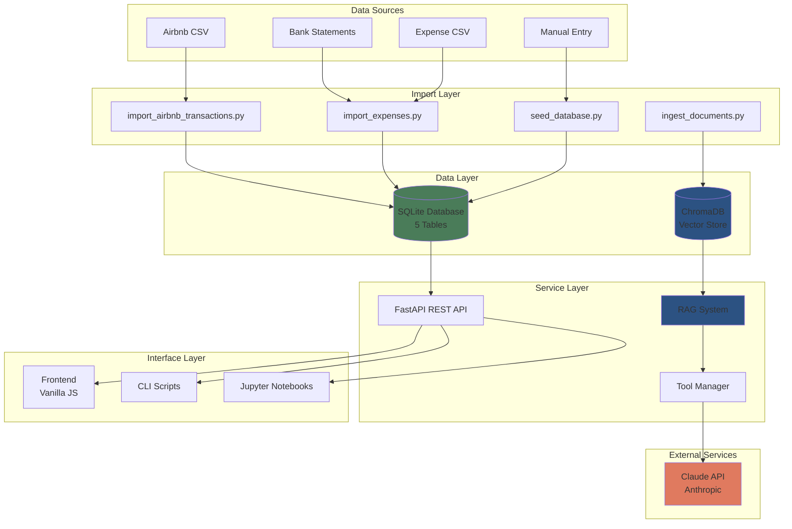
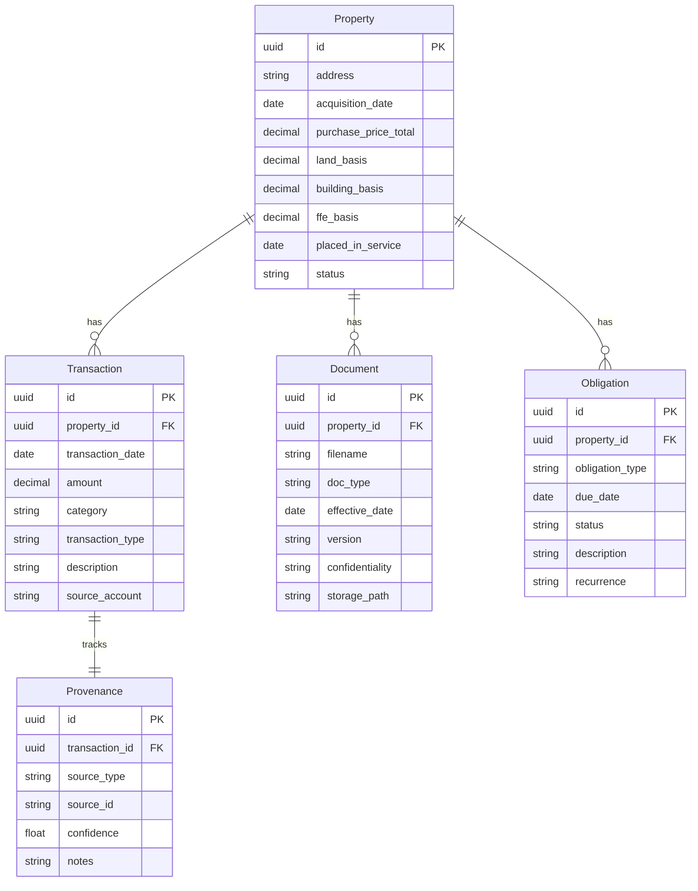
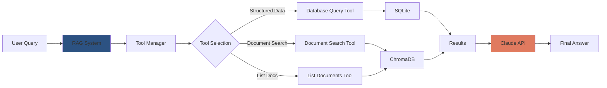
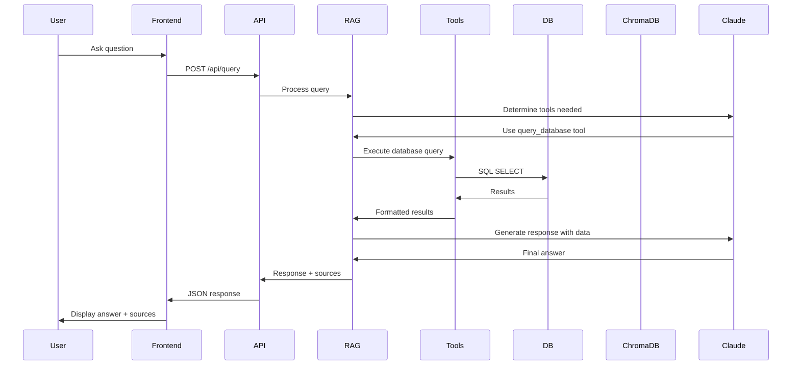
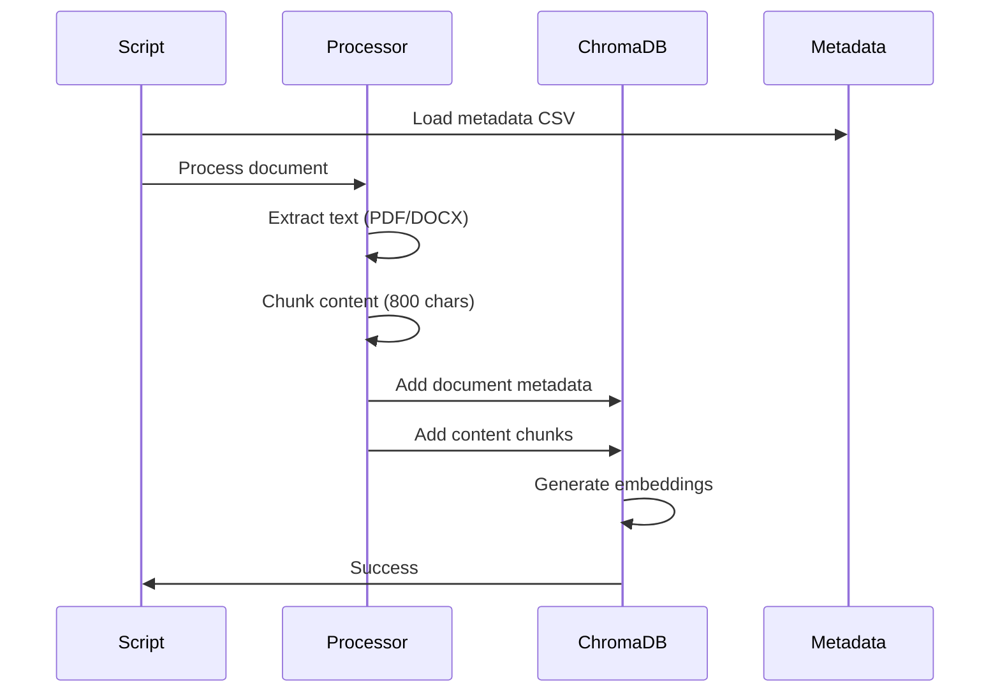
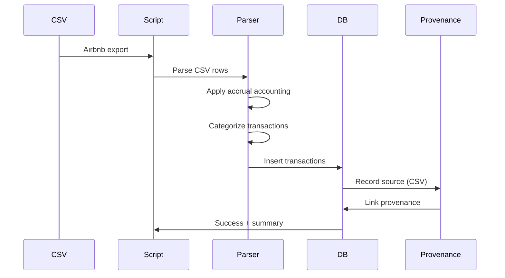

# System Design

Poolula Platform uses a modular architecture that separates concerns while maintaining simplicity for a single-developer project.

## Architecture Principles

1. **Data-First** - Database as single source of truth
2. **Modular Monolith** - Clear module boundaries without microservices complexity
3. **Type Safety** - Pydantic models throughout
4. **Provenance Tracking** - Every data point records its source
5. **Progressive Disclosure** - Simple defaults with detailed options available

## High-Level Architecture



## Core Components

### 1. Database Layer

**SQLite Database** - Single source of truth for structured data

**Tables:**



**Design Decisions:**

- **SQLite** for development/small deployments (easy backup, no server)
- **UUIDs** for primary keys (distributed system ready)
- **Soft deletes** via `deleted_at` timestamp (audit trail preservation)
- **Computed properties** in SQLModel for derived values (e.g., `total_basis`)

### 2. Vector Store Layer

**ChromaDB** - Semantic search for business documents

**Collections:**

1. **document_catalog** - Document metadata (titles, types, dates)
2. **document_content** - Chunked document content with embeddings

**Embedding Strategy:**

- ONNXMiniLM_L6_V2 (ChromaDB default)
- No external model dependencies (self-contained)
- Chunk size: 800 characters
- Chunk overlap: 200 characters

### 3. Service Layer

#### FastAPI REST API

**Responsibilities:**

- HTTP request handling
- Input validation (Pydantic models)
- Business logic orchestration
- Response formatting
- CORS handling

**Endpoints:**

- `/api/query` - Chatbot queries
- `/api/v1/properties` - Property CRUD
- `/api/v1/transactions` - Transaction CRUD
- `/api/v1/documents` - Document metadata
- `/api/v1/obligations` - Obligation CRUD
- `/health` - Health checks

#### RAG System

**Components:**



**Tool System:**

1. **query_database** - SQL SELECT queries (properties, transactions, documents, obligations)
2. **search_document_content** - Semantic search in documents
3. **list_business_documents** - List available documents

**Multi-Round Tool Calling:**

- Maximum 2 rounds per query
- Sequential reasoning (use first tool results to inform second tool)
- Example: Query properties → Search specific property documents

### 4. Interface Layer

#### Frontend (Vanilla JS)

**Why Vanilla JS?**

- No build step required
- Fast page loads
- Easy to understand and modify
- No framework lock-in

**Components:**

- Chat interface with markdown rendering (Marked.js)
- 4 persona-based help sections
- Document upload (drag & drop)
- Resources sidebar

#### CLI Scripts

**Purpose:**

- Data import automation
- Document ingestion
- Database seeding
- Interactive chatbot (for terminal users)

**Key Scripts:**

- `cli.py` - Interactive chatbot CLI
- `import_airbnb_transactions.py` - Import Airbnb data
- `ingest_documents.py` - Process and embed documents
- `seed_obligations.py` - Create compliance deadlines

## Data Flow

### Query Processing Flow



### Document Ingestion Flow



### Transaction Import Flow



## Design Patterns

### 1. Provenance Tracking

Every transaction records its source:

```python
class Provenance(SQLModel, table=True):
    id: UUID = Field(default_factory=uuid4, primary_key=True)
    transaction_id: UUID = Field(foreign_key="transaction.id")
    source_type: SourceType  # CSV_IMPORT, MANUAL_ENTRY, etc.
    source_id: str  # filename, user ID, etc.
    confidence: float = 1.0
    notes: Optional[str] = None
```

**Benefits:**

- Audit trail for all data
- Identify data quality issues
- Support data lineage queries

### 2. Soft Deletes

Records are never hard-deleted:

```python
class BaseModel(SQLModel):
    created_at: datetime = Field(default_factory=datetime.utcnow)
    updated_at: datetime = Field(default_factory=datetime.utcnow)
    deleted_at: Optional[datetime] = None
```

**Benefits:**

- Preserve history
- Enable "undo" functionality
- Maintain referential integrity

### 3. Type Safety

Pydantic models throughout:

```python
from pydantic import BaseModel

class QueryRequest(BaseModel):
    query: str
    session_id: Optional[str] = None

class QueryResponse(BaseModel):
    answer: str
    sources: list
    session_id: str
```

**Benefits:**

- Automatic validation
- IDE autocomplete
- Self-documenting code

### 4. Tool-Based Architecture

AI uses tools instead of direct DB access:

```python
tools = [
    {
        "name": "query_database",
        "description": "Query structured data",
        "input_schema": {...}
    },
    {
        "name": "search_document_content",
        "description": "Search documents",
        "input_schema": {...}
    }
]
```

**Benefits:**

- Safety (no SQL injection, no writes)
- Flexibility (add new tools easily)
- Transparency (see what AI is doing)

## Scalability Considerations

### Current (Phase 1)

- **Database**: SQLite (single file)
- **Users**: Single user / small team
- **Documents**: 100s of documents
- **Transactions**: 10,000s of transactions

### Future (Production)

- **Database**: PostgreSQL (multi-user support)
- **Caching**: Redis for session management
- **Load Balancing**: Multiple API instances
- **Authentication**: OAuth2 / JWT
- **Rate Limiting**: Per-user limits

## Security Considerations

### Current State

- **Local-only** deployment
- **No authentication** (development mode)
- **Read-only** AI queries (no database writes)
- **Local file storage** (documents not in cloud)

### Production Requirements

- **Authentication**: User login required
- **Authorization**: Role-based access control (RBAC)
- **HTTPS**: TLS encryption for all traffic
- **API Keys**: Secure API key management
- **Input Validation**: Strict validation on all inputs
- **Rate Limiting**: Prevent abuse

## Technology Choices

### Why Python 3.13?

- Latest language features
- Strong typing support
- Excellent AI/ML ecosystem
- FastAPI performance

### Why SQLite?

- Zero configuration
- Single file database
- Perfect for development
- Easy backups (copy file)
- Upgrade path to PostgreSQL

### Why FastAPI?

- High performance (async support)
- Auto-generated API docs
- Type hints throughout
- Modern Python (Pydantic v2)

### Why ChromaDB?

- Easy local deployment
- Built-in embedding functions
- No external dependencies
- Upgrade path to cloud vector stores

### Why Vanilla JS?

- No build step
- Fast loading
- Easy to modify
- No framework lock-in

## Next Steps

- [Data Models](data-models.md) - Detailed schema documentation
- [API Design](api-design.md) - API architecture details
- [Testing Guide](../testing/testing.md) - Testing and development workflow

---

**Questions about the architecture?** → [FAQ](../faq.md)
