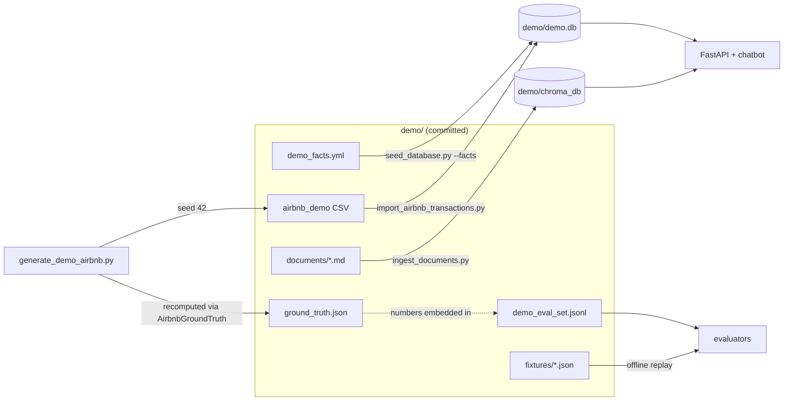

# Demo Mode Walkthrough

Poolula Platform ships with a **demo persona**: a complete, fictional dataset
that drives every part of the platform — database, transaction import, RAG
document corpus, and both evaluators — in full isolation from real client
data. It exists so the platform can be shown publicly (interviews, client
demos, screen recordings) without exposing anything sensitive.

!!! note "Data safety"
    Everything in `demo/` is invented: the address, purchase price, trust
    name, bank accounts, insurance policy, guest names, and every dollar
    amount. Only the company name ("Poolula LLC") is real, with the client's
    approval. The demo runs against its own SQLite database (`demo/demo.db`)
    and its own ChromaDB vector store (`demo/chroma_db/`) — the real
    `poolula.db` and `chroma_db/` are never read or written.

    The *repository* still contains real data (`poolula_facts.yml`, the
    `documents/` tree). Demo mode isolates what runs and what's on screen;
    a repo-level scrub is a separate step for a future public repo.

## The fictional persona

| Fact | Demo value |
|---|---|
| Property | 742 Juniper Bend Court, Granite Pass, CO 81249 |
| Airbnb listing | "Juniper Bend Hideaway" |
| Acquired | 2024-05-20 for $517,500 (land $93,150 / building $424,350) |
| FF&E | $12,000 · Placed in service 2025-01-15 |
| Sole member | Bluebird Family Trust (revocable) |
| Registered agent | Peakview Registered Agents LLC |
| Bank | High Mesa Credit Union Business Checking x4410 + Summit Business Card |
| Insurance | Summit Ridge Mutual Insurance, SRM-7741-STR, $2,340/yr, renews May 1 |
| Property tax | Kestrel County Treasurer |
| Bookings | 58 stays Dec 2024 – Nov 2025, ~$40.4k gross, ski-season seasonality |

## How it fits together



Two environment variables select the demo environment; unset them and
everything reverts to real data:

- `DATABASE_URL=sqlite:///demo/demo.db`
- `POOLULA_CHROMA_PATH=demo/chroma_db`

## Set up

```bash
# Build (or refresh) the demo environment — real data untouched
bash scripts/setup_demo.sh

# Start over from scratch
bash scripts/setup_demo.sh --reset
```

The script creates the schema, seeds the property from `demo/demo_facts.yml`,
seeds obligations with the fictional treasurer/insurer, imports the synthetic
Airbnb CSV, and ingests the five demo documents into the demo vector store.
Re-running it is safe: property, transactions, and documents all dedup.

## Run the platform in demo mode

```bash
DATABASE_URL=sqlite:///demo/demo.db POOLULA_CHROMA_PATH=demo/chroma_db \
    uv run uvicorn apps.api.main:app --port 8082
```

Then open the frontend or hit the API — everything returns fictional data:

```bash
curl localhost:8082/api/v1/properties
curl -X POST localhost:8082/api/query \
     -H 'Content-Type: application/json' \
     -d '{"query": "Who insures the property and when does the policy renew?"}'
```

## Evaluate

**Offline (no API key needed)** — replays the committed fixtures:

```bash
uv run python scripts/evaluate_chatbot.py \
    --eval-set demo/demo_eval_set.jsonl \
    --fixture demo/fixtures/chatbot_fixture.json \
    --markdown output/demo_eval_report.md

uv run python scripts/evaluate_airbnb.py \
    --csv demo/airbnb_demo_2024-12_2025-11.csv \
    --fixture demo/fixtures/airbnb_fixture.json
```

**Live (needs `ANTHROPIC_API_KEY` and the demo env vars)** — queries the real
RAG pipeline against demo data, and can re-record the fixtures:

```bash
export DATABASE_URL=sqlite:///demo/demo.db POOLULA_CHROMA_PATH=demo/chroma_db

uv run python scripts/evaluate_chatbot.py \
    --eval-set demo/demo_eval_set.jsonl \
    --record-fixture demo/fixtures/chatbot_fixture.json

uv run python scripts/evaluate_airbnb.py \
    --csv demo/airbnb_demo_2024-12_2025-11.csv \
    --record-fixture demo/fixtures/airbnb_fixture.json
```

## Regenerating the dataset

The Airbnb CSV is produced by a deterministic generator; the same seed always
yields byte-identical output:

```bash
uv run python scripts/generate_demo_airbnb.py --seed 42
```

The generator writes `demo/ground_truth.json` by loading the CSV back through
the evaluator's own parser (`AirbnbGroundTruth`), so evaluation expectations
match the data by construction. `tests/test_demo_data.py` pins the committed
CSV, ground truth, and the numeric keywords in `demo/demo_eval_set.jsonl` to
each other — if you regenerate with a different seed, tests fail until the
eval set is updated and fixtures re-recorded.

## Why this design (talking points)

- **Accrual accounting**: rental revenue is recognized at guest checkout
  (End date), service fees at payout — the ground-truth calculator and the
  importer implement the same rule, so the evaluator's numeric assertions
  validate the whole pipeline, not just the LLM.
- **Record/replay evaluation**: fixtures make the eval suite runnable with
  zero credentials — clone the repo, replay the fixtures, read the
  diagnostic report.
- **Ground truth by construction**: the generator derives expected numbers
  using the evaluator's own parser, eliminating an entire class of
  eval-set drift bugs, and a test guards the sync.
- **Isolation via two env vars**: no config framework, no demo flags in
  business logic — `DATABASE_URL` and `POOLULA_CHROMA_PATH` are the entire
  switch (KISS, matching the platform's design principles).
