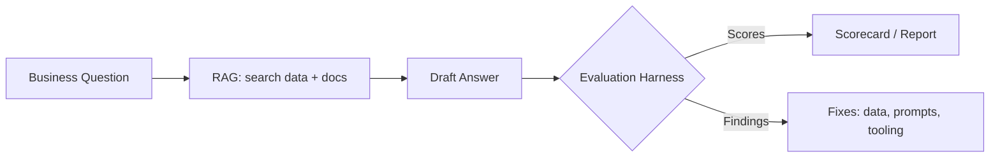
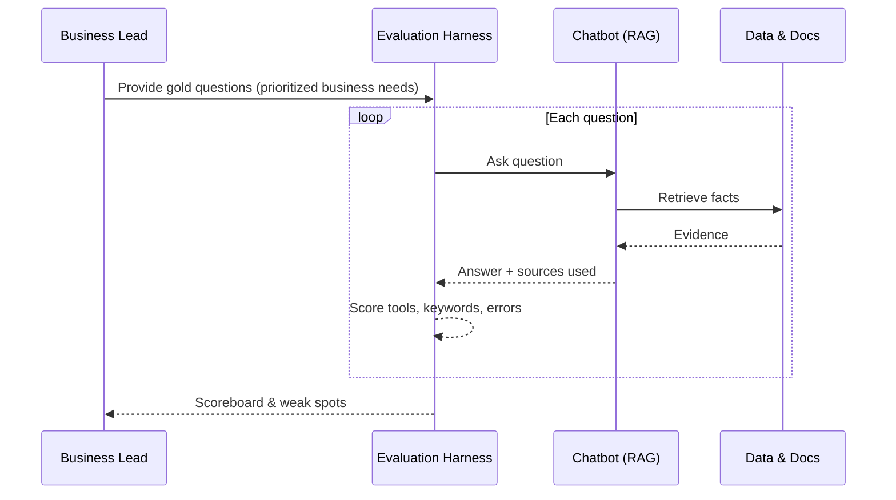
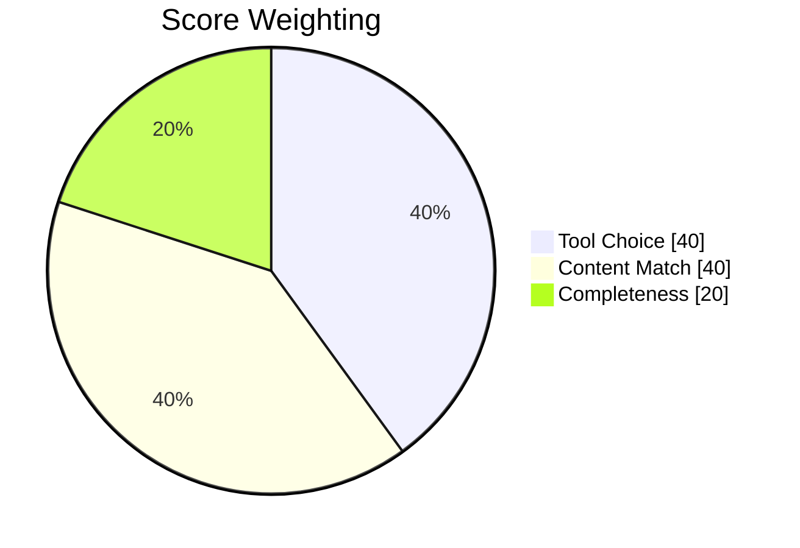
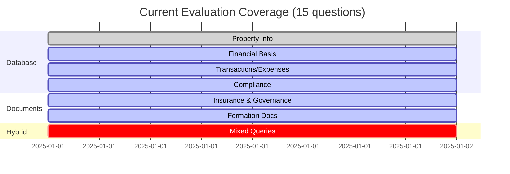

# Evaluation Harness: Executive Walkthrough

This document gives business leaders a clear, intuitive understanding of how the **evaluation harness** ensures the Poolula chatbot stays accurate, grounded, and trustworthy. Think of it as the **quality-control lane** at the end of a production line—except instead of checking physical products, it checks AI answers.

---

# 1. What the Chatbot Is Meant to Do

The chatbot acts as a **financial and compliance analyst** for Poolula LLC. It answers questions about:

- Property details  
- Rental income, expenses, obligations, and basis  
- Business documents such as insurance policies, filings, and the operating agreement  

It draws from two core information sources:

- **Structured Data** (database tables: properties, transactions, obligations)  
- **Unstructured Documents** (PDFs: leases, policies, agreements)

It uses **Retrieval-Augmented Generation (RAG)**—meaning:  
1) retrieve facts, then  
2) draft an answer with citations.

```mermaid
graph LR
  A[Business question] --> B{Pick search route?}
  B -->|Financial fact| C[Query database of properties, transactions, obligations]
  B -->|Document detail| D[Search documents (policies, agreements)]
  C --> E[Combine findings]
  D --> E
  E --> F[Summarize answer with sources]
```

---

# 2. What an Evaluation Harness Is

In plain English:

**A test-drive loop that runs a fixed set of important business questions through the chatbot and scores how well it answers.**

In business analogy terms:

**A mystery shopper for the AI.** It asks the same questions every week, checks which “shelves” (data sources) the bot uses, and records a scorecard.

It serves as:

- **Scoreboard:** tracks accuracy trends  
- **Referee:** judges routing decisions, factual alignment, and completeness  



---

# 3. How the Evaluation Loop Works



---

# 4. What We Measure Today (The Three Scoring Lenses)



### Tool Choice (40%)
Did the bot choose the correct retrieval method?  
(e.g., `query_database` vs. `search_document_content`)

### Content Match (40%)
Did the answer contain the expected concepts, terminology, or facts?

### Completeness (20%)
Did the bot return a non-error, reasonably shaped response?

---

# 5. Current Evaluation Set (Coverage Overview)

We currently have **15 questions** covering:

- Property info  
- Basis and depreciation  
- Revenue & expenses  
- Obligations and transactions  
- Governance & insurance documents  
- Hybrid queries  



*Interpretation:* Coverage is thin—single-turn, limited nuance, no seasonal or multi-property scenarios.

---

# 6. Strengths of the Current System

- **Fast regression detection**  
- **Aligned to core business workflows**  
- **Good at catching routing mistakes**  
- **Repeatable & lightweight**  

---

# 7. Gaps, Risks, and Where This Can Mislead Leadership

### A. Small Question Set → Blind Spots  
Many realistic scenarios remain untested (e.g., seasonal trends, partial-year depreciation, insurance renewals).

### B. Keyword-Based Scoring Is Shallow  
Allows partially correct or numerically wrong answers to pass.

### C. Tool-Use Detection Is Inferred  
A missing citation can mis-score an otherwise correct answer.

### D. Retrieval Quality Is Not Verified  
We don’t check whether the cited paragraphs **actually support** the response.

### E. Missing Edge Cases  
No tests for missing documents, multi-step reasoning, or numerical reconciliation.

### F. No Trend Tracking  
Executives cannot yet visually see improvement or degradation over time.

---

# 8. Straightforward Recommendations

### 1. Expand the question set to 50–75 prompts  
Include multi-step, seasonal, edge-case, and negative tests.

### 2. Add reference (“gold”) answers  
Including acceptable numeric ranges & exact phrases.

### 3. Validate retrieval results  
Verify that returned IDs and document passages match expectations.

### 4. Log actual tool calls  
Replace heuristic inference with explicit instrumentation.

### 5. Track performance across versions/releases  
Use dashboards or weekly snapshots.

### 6. Add a business-owner review lane  
For borderline answers (40–70%), collect a human “trust/not trust” decision.

---

# 9. Leadership Summary (Shareable)

> “Every week, we run a fixed set of business questions through the chatbot—like a secret shopper. The harness checks whether it searched the right place, cited the right facts, and avoided errors. Scores roll up into a dashboard. If accuracy drifts, we know before customers ever see a problem.”

---
