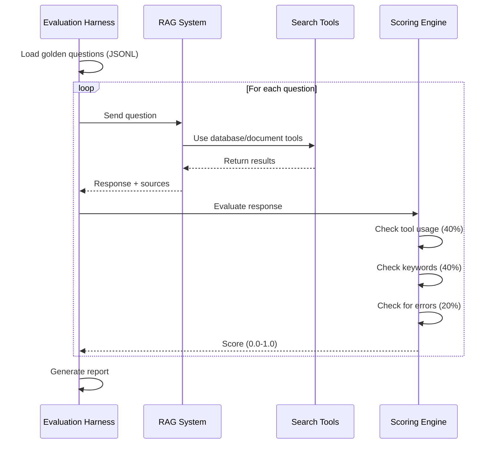

# Evaluation Harness

The evaluation harness systematically tests the Poolula Platform chatbot against a golden question set, providing objective quality metrics.

## Overview

**File:** `scripts/evaluate_chatbot.py`

**Purpose:** Automated testing of chatbot responses using pre-defined questions with expected outcomes.

**Output:** Detailed scoring report showing performance across question categories.

## How It Works



## Running the Harness

### Basic Usage

```bash
# Run evaluation with default question set
python scripts/evaluate_chatbot.py

# Output:
# ━━━━━━━━━━━━━━━━━━━━━━━━━━━━━━━━━━━━━━━━━━
#  POOLULA CHATBOT EVALUATION RESULTS
# ━━━━━━━━━━━━━━━━━━━━━━━━━━━━━━━━━━━━━━━━━━
#  Overall Score: 87.3%
#
#  Component Scores:
#   - Tool Usage: 93.3%
#   - Response Quality: 86.7%
#   - Error Rate: 0.0%
# ━━━━━━━━━━━━━━━━━━━━━━━━━━━━━━━━━━━━━━━━━━
```

### Verbose Mode

```bash
# Show detailed per-question results
python scripts/evaluate_chatbot.py --verbose

# Output shows:
# - Question text
# - AI response
# - Tools used
# - Expected vs actual
# - Individual scores
```

### Custom Question Set

```bash
# Use custom evaluation questions
python scripts/evaluate_chatbot.py --eval-set data/my_questions.jsonl
```

## Question File Format

Golden questions are stored in JSONL (JSON Lines) format:

```json
{
  "question": "What is our property's total depreciable basis?",
  "category": "property_financials",
  "expected_tools": ["query_database"],
  "expected_keywords": ["basis", "depreciation", "442300"],
  "context": "Tests ability to query property financial data"
}
```

### Required Fields

| Field | Type | Description |
|-------|------|-------------|
| `question` | string | The user query to test |
| `category` | string | Question category for grouping results |
| `expected_tools` | array | Tools the AI should use |
| `expected_keywords` | array | Keywords that should appear in response |

### Optional Fields

| Field | Type | Description |
|-------|------|-------------|
| `context` | string | Why this question matters |
| `expected_entities` | array | Entities that should be mentioned |

## Scoring Components

### 1. Tool Usage (40% of score)

**What it checks:** Did the AI choose the correct search tools?

**Available tools:**

- `query_database` - Query SQLite database for properties, transactions, obligations
- `search_document_content` - Semantic search through ingested documents
- `list_business_documents` - List available documents

**Scoring:**

- ✅ All expected tools used: 1.0
- ❌ Missing or wrong tools: 0.0

**Example:**

```python
# Question: "What was my rental income in August 2024?"
# Expected: ["query_database"]
# AI used: ["query_database"] ✓
# Tool score: 1.0
```

### 2. Response Quality (40% of score)

**What it checks:** Does the response contain expected information?

**Methodology:** Keyword matching (case-insensitive)

**Scoring:**

```
score = (keywords_found / total_expected_keywords)
```

**Example:**

```python
# Question: "What is our property address?"
# Expected keywords: ["900", "9th", "Montrose", "CO"]
# Response: "Your property is located at 900 S 9th St, Montrose, CO 81401"
# Keywords found: 4/4
# Quality score: 1.0
```

### 3. Error Handling (20% of score)

**What it checks:** Did the query complete without errors?

**Scoring:**

- ✅ No errors: 1.0
- ❌ Exception or error response: 0.0

**Common errors caught:**

- Database connection failures
- Tool execution errors
- Empty/null responses
- API exceptions

## Output Report Structure

### Summary Statistics

```
Overall Score: 87.3%
Total Questions: 15
Passed (≥70%): 13
Failed (<70%): 2
```

### Category Breakdown

```
Performance by Category:
  property_info:        100.0% (3/3 passed)
  property_financials:   93.3% (3/3 passed)
  transactions:          86.7% (2/3 passed)
  documents:            100.0% (2/2 passed)
  hybrid:                73.3% (2/3 passed)
```

### Individual Results

```
[✓] Question: What is our EIN number?
    Score: 100.0%
    Tools: query_database ✓
    Keywords: 4/4 found

[✗] Question: Show rental income by month for 2024
    Score: 53.3%
    Tools: query_database ✓
    Keywords: 2/5 found (missing: "August", "breakdown")
```

## Interpreting Results

### Score Ranges

| Score | Interpretation | Action |
|-------|---------------|---------|
| 90-100% | Excellent | Maintain quality |
| 80-89% | Good | Minor improvements possible |
| 70-79% | Acceptable | Review failed questions |
| 60-69% | Needs improvement | Investigation required |
| <60% | Poor | Significant issues |

### Common Issues

**Low tool usage score:**

- AI isn't recognizing when to use database vs documents
- Tool definitions may need clarification
- System prompt may need adjustment

**Low response quality score:**

- Missing expected keywords suggests incomplete answers
- May need better context in questions
- Retrieval quality issues

**High error rate:**

- Check database connectivity
- Review tool error handling
- Verify data exists for questions

## Integration with Development

### Pre-Commit Workflow

```bash
# Before committing chatbot changes
python scripts/evaluate_chatbot.py

# Only commit if score ≥ baseline
# Current baseline: 85%
```

### CI/CD Integration

```yaml
# .github/workflows/test.yml (future)
- name: Run evaluation harness
  run: python scripts/evaluate_chatbot.py

- name: Check threshold
  run: |
    if [ $SCORE -lt 85 ]; then
      echo "Score below threshold!"
      exit 1
    fi
```

## Code Structure

### Main Class: ChatbotEvaluator

```python
class ChatbotEvaluator:
    """Evaluation harness for chatbot quality assessment"""

    def load_eval_set(self, eval_path: str) -> List[Dict]
        # Load questions from JSONL

    def evaluate_response(...) -> Tuple[float, Dict]
        # Score a single response

    def run_evaluation(...) -> Dict
        # Run full evaluation suite

    def print_results(self, results: Dict)
        # Generate detailed report
```

### Key Methods

**`evaluate_response()`:**

- Takes question, response, sources, expected values
- Returns score (0.0-1.0) and detailed breakdown
- Checks tools, keywords, errors independently

**`run_evaluation()`:**

- Iterates through all questions
- Calls RAG system for each
- Collects and aggregates scores
- Handles exceptions gracefully

## Advanced Usage

### Creating Custom Evaluations

```bash
# 1. Create custom question set
cat > data/my_eval.jsonl << EOF
{"question": "Custom question 1", "category": "test", ...}
{"question": "Custom question 2", "category": "test", ...}
EOF

# 2. Run evaluation
python scripts/evaluate_chatbot.py --eval-set data/my_eval.jsonl
```

### Tracking Over Time

```bash
# Save results with timestamp
python scripts/evaluate_chatbot.py > results/eval_$(date +%Y%m%d).txt

# Compare to previous runs
diff results/eval_20241114.txt results/eval_20241115.txt
```

## Future Enhancements

See [Improvement Roadmap](roadmap.md) for planned features:

- LLM-as-judge scoring (more nuanced than keyword matching)
- Retrieval accuracy metrics (precision/recall)
- Latency tracking per question
- User feedback integration
- A/B testing framework

## Related Documentation

- [Question Design](questions.md) - How questions are designed
- [Scoring Methodology](scoring.md) - Detailed scoring explanation
- [Results & Baselines](results.md) - Current performance
- [Testing Guide](../testing/guide.md) - Traditional pytest tests
