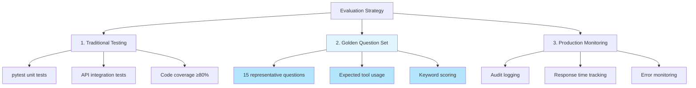

# Why Evaluate LLM Applications?

Systematic evaluation of AI-powered applications is critical for ensuring quality, reliability, and continuous improvement.

## The Challenge

Unlike traditional software, Large Language Model (LLM) applications produce **non-deterministic outputs**. The same query can produce different responses, making traditional testing approaches insufficient.

**Traditional testing:**

- Unit tests verify specific outputs
- Integration tests check exact API responses
- Pass/fail is binary

**LLM applications:**

- Responses vary even with identical inputs
- Multiple correct answers exist for one question
- Quality exists on a spectrum

## Why Evaluation Matters

### 1. Quality Assurance

Ensure the chatbot provides accurate, relevant answers to business questions without relying on manual spot-checking.

### 2. Regression Detection

Detect when code changes or data updates degrade response quality before deploying to production.

### 3. Continuous Improvement

Track improvements over time as you enhance prompts, tools, or data sources.

### 4. Tool Usage Validation

Verify the AI correctly chooses database queries vs. document search for different question types.

## Poolula Platform Evaluation Approach

### Three-Tier Strategy

### Golden Question Set

A curated set of 15 questions representing core use cases:

- Property information queries
- Financial calculations
- Transaction searches
- Document searches
- Hybrid queries (database + documents)

Each question includes:

- Expected tools the AI should use
- Keywords the response should contain
- Category for performance tracking

### Automated Scoring

Responses are scored on three components:

1. **Tool Usage (40%)** - Did the AI select the correct tools?
2. **Response Quality (40%)** - Does the answer contain expected information?
3. **Error Handling (20%)** - No crashes or error responses

This produces a 0-100% score for each question and overall performance metrics.

## Learn More

- [Evaluation Harness](harness.md) - How the evaluation system works
- [Question Design](questions.md) - The golden question set
- [Scoring Methodology](scoring.md) - How responses are scored
- [Results & Baselines](results.md) - Current performance metrics
- [Improvement Roadmap](roadmap.md) - Planned enhancements

## Key Insights

**For Portfolio/Employers:**

This evaluation framework demonstrates:

- Understanding of AI-specific quality challenges
- Systematic approach to testing non-deterministic systems
- Production-ready thinking (monitoring, baselines, iteration)
- Ability to balance multiple quality dimensions

**For Development:**

The evaluation harness provides:

- Fast feedback during development
- Objective quality metrics
- Regression prevention
- Data-driven improvement decisions
