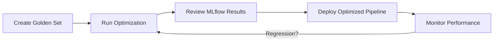
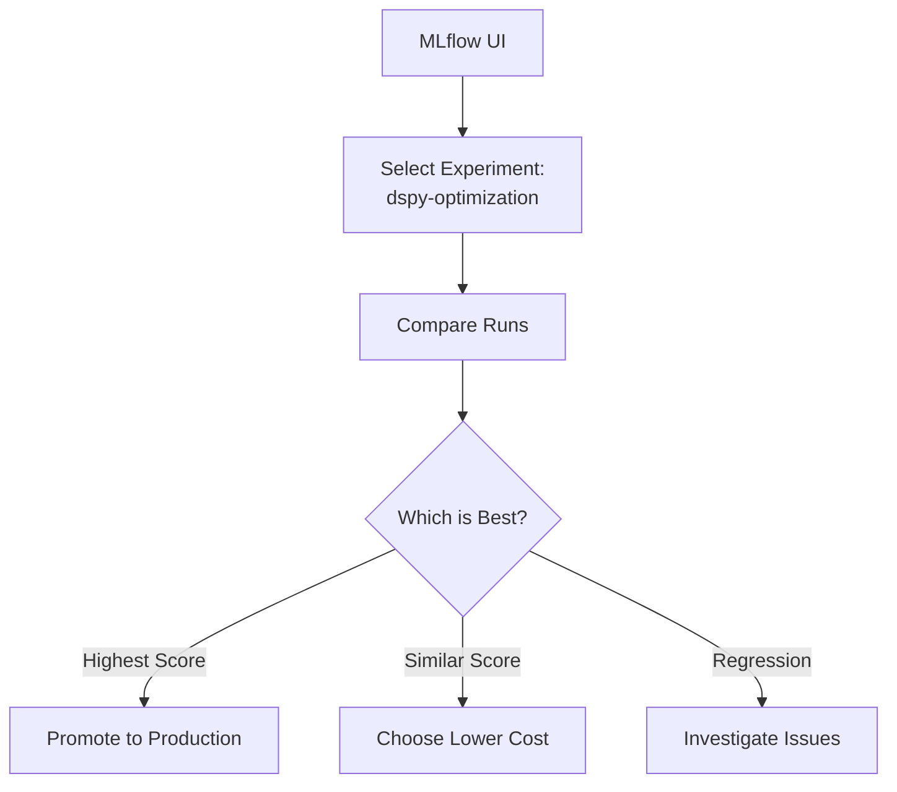
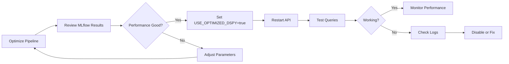
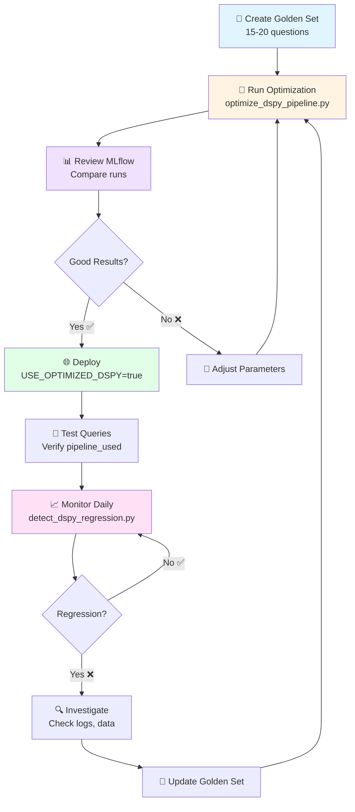

# Getting Started: DSPy + MLflow Integration

**Quick Start Guide for Optimizing Your RAG Chatbot**

This guide walks you through optimizing the Poolula Platform chatbot using DSPy and tracking experiments with MLflow. Perfect for first-time users!

---

## What You'll Learn

- ✅ Create your "Golden Set" of evaluation questions
- ✅ Run DSPy pipeline optimization
- ✅ Track experiments with MLflow
- ✅ Deploy optimized pipelines to production
- ✅ Monitor performance and detect regressions

**Time Required**: 30-45 minutes
**Prerequisites**: Poolula Platform installed, API key configured

---

## Overview



**What is DSPy?**
DSPy is a framework for programmatically optimizing LLM prompts and pipelines. It learns from examples to improve response quality.

**What is MLflow?**
MLflow tracks machine learning experiments, making it easy to compare different optimization runs and manage model versions.

---

## Step 1: Create Your Golden Set

A "Golden Set" is a collection of representative questions with expected answers that define good performance for your chatbot.

### What Makes a Good Golden Set?

✅ **Representative**: Cover all major question types (properties, transactions, documents)
✅ **Specific**: Include real questions users actually ask
✅ **Measurable**: Have clear expected keywords or answers
✅ **Diverse**: Mix simple and complex queries
✅ **Balanced**: 15-20 questions is a good starting point

### Example Golden Set Questions

```jsonl
{"question": "What properties does Poolula LLC own?", "expected_content": ["property", "address", "Montrose"], "category": "property_info"}
{"question": "What was our rental income in July 2025?", "expected_content": ["rental income", "July", "2025", "$"], "category": "transactions"}
{"question": "What insurance policies do we have?", "expected_content": ["insurance", "Travelers", "landlord"], "category": "documents"}
```

### Creating Your Golden Set

**Option 1: Start with Existing Set**

The platform includes a curated 20-question evaluation set:

```bash
# View existing questions
cat apps/evaluator/poolula_eval_set.jsonl
```

**Option 2: Create Your Own**

1. **Identify Common Questions**: Review chatbot logs for frequently asked questions
2. **Add Edge Cases**: Include questions that are challenging or expose weaknesses
3. **Define Expected Content**: List keywords or phrases that should appear in good answers

Format (one question per line in JSONL):

```json
{
  "question": "Your question here",
  "expected_content": ["keyword1", "keyword2", "keyword3"],
  "category": "property_info|transactions|documents|compliance",
  "type": "lookup|aggregation|multi_step"
}
```

**Save as**: `apps/evaluator/my_golden_set.jsonl`

### Quality Checklist

Before optimizing, verify your Golden Set:

- [ ] 15-20 questions minimum (more is better for complex domains)
- [ ] Questions cover all major topics
- [ ] Expected keywords are specific and measurable
- [ ] Questions represent real user needs
- [ ] Mix of easy, medium, and hard questions

---

## Step 2: Run Your First Optimization

Now let's optimize the chatbot using your Golden Set!

### Quick Start (Default Settings)

```bash
# Run optimization with default settings
uv run python scripts/optimize_dspy_pipeline.py
```

**What Happens**:
1. Loads your Golden Set (splits 75% train, 25% dev)
2. Evaluates baseline RAG system
3. Runs BootstrapFewShot optimization
4. Evaluates optimized pipeline
5. Saves artifacts to `artifacts/optimized_dspy_program/`
6. Logs everything to MLflow

**Expected Runtime**: 5-10 minutes

### Understanding the Output

```
BASELINE EVALUATION
──────────────────────────────────────────────
Baseline Score: 65.0%

OPTIMIZATION
──────────────────────────────────────────────
  Optimizing with BootstrapFewShot
  Using 4 hand-crafted demos
  ✅ Compilation complete

OPTIMIZED EVALUATION
──────────────────────────────────────────────
Optimized Score: 78.0%

RESULTS
──────────────────────────────────────────────
  Baseline:    65.0%
  Optimized:   78.0%
  Improvement: +13.0% (+13.0 percentage points)

✅ Optimization improved performance!
```

### Customizing Optimization

```bash
# More bootstrapped examples (slower but potentially better)
uv run python scripts/optimize_dspy_pipeline.py --max-bootstrapped 6

# Different LLM provider
uv run python scripts/optimize_dspy_pipeline.py --provider openai

# More retrieval results (better for complex questions)
uv run python scripts/optimize_dspy_pipeline.py --k 10

# Verbose output
uv run python scripts/optimize_dspy_pipeline.py --verbose
```

### Optimization Parameters Explained

| Parameter | Default | Description | When to Change |
|-----------|---------|-------------|----------------|
| `--max-bootstrapped` | 4 | Number of automatically generated examples | Increase (6-8) if you have >20 training questions |
| `--max-labeled` | 3 | Number of hand-crafted examples | Keep at 3-4 |
| `--k` | 5 | Retrieval results per query | Increase (8-10) for complex multi-part questions |
| `--use-hybrid` | True | Use database + vector retrieval | Keep True for best coverage |
| `--provider` | anthropic | LLM provider | Try different providers to compare quality/cost |

---

## Step 3: Review MLflow Results

MLflow captures all your optimization runs for easy comparison.

### Launch MLflow UI

```bash
mlflow ui
```

Open: http://localhost:5000

### What You'll See

**Experiments Tab**:
- `dspy-optimization`: All your optimization runs

**Each Run Shows**:
- **Parameters**: Hyperparameters used (k, provider, max_bootstrapped, etc.)
- **Metrics**: Baseline score, optimized score, improvement
- **Artifacts**: Optimized program files, metadata, results summary
- **Tags**: Searchable labels (stage, pipeline, optimizer, result)

### Comparing Runs



**To Compare Runs**:
1. Select 2-3 runs using checkboxes
2. Click "Compare" button
3. Review side-by-side metrics and parameters
4. Download artifacts to inspect optimized programs

### Key Metrics to Watch

| Metric | Good Target | Meaning |
|--------|-------------|---------|
| `baseline_score` | - | Your starting point (baseline RAG) |
| `optimized_score` | ≥ baseline + 5% | Optimized pipeline performance |
| `improvement_absolute` | ≥ 0.05 | Absolute improvement (5%+) |
| `improvement_percentage` | ≥ 5.0 | Percentage point improvement |

**Tags for Filtering**:
- `result:improved` - Runs that beat baseline
- `result:regressed` - Runs worse than baseline
- `provider:anthropic` - Runs using specific provider

---

## Step 4: Deploy Optimized Pipeline

Once you have a good optimized program, deploy it to production!

### Enable Optimized DSPy in API

```bash
# Set environment variable
export USE_OPTIMIZED_DSPY=true
export OPTIMIZED_DSPY_PATH=artifacts/optimized_dspy_program
export LLM_PROVIDER=anthropic

# Restart API server
uv run uvicorn apps.api.main:app --reload --port 8082
```

**What Happens**:
- API loads optimized program at startup
- All `/api/v1/chat/query` requests use optimized pipeline
- Falls back to baseline RAG if program fails to load

### Verify Deployment

```bash
# Check DSPy status endpoint
curl http://localhost:8082/api/v1/chat/dspy-status
```

**Expected Response**:
```json
{
  "optimized_dspy_enabled": true,
  "program_loaded": true,
  "program_class": "PoolulaRAGPipeline",
  "artifact_path": "artifacts/optimized_dspy_program",
  "llm_provider": "anthropic",
  "metadata": {
    "optimizer": "BootstrapFewShot",
    "timestamp": "2025-12-16T10:30:00",
    "program_class": "PoolulaRAGPipeline"
  }
}
```

### Test in Production

```bash
# Send test query
curl -X POST http://localhost:8082/api/v1/chat/query \
  -H "Content-Type: application/json" \
  -d '{"query": "What properties does Poolula LLC own?"}'
```

**Response includes**:
```json
{
  "answer": "...",
  "sources": [...],
  "session_id": "...",
  "pipeline_used": "optimized_dspy"
}
```

✅ Look for `"pipeline_used": "optimized_dspy"` to confirm!

### Deployment Workflow



---

## Step 5: Monitor Performance

After deploying, monitor performance to catch regressions early.

### Manual Regression Check

```bash
# Run regression detection
uv run python scripts/detect_dspy_regression.py
```

**What It Does**:
1. Evaluates baseline RAG on dev set
2. Evaluates optimized DSPy on dev set
3. Compares scores (regression = >10% drop)
4. Logs results to MLflow
5. Saves report to `artifacts/regression_reports/`

**Expected Output**:
```
BASELINE RAG EVALUATION
──────────────────────────────────────────────
Baseline Results:
  Average Score: 65.0%
  Passed: 4/5

OPTIMIZED DSPY EVALUATION
──────────────────────────────────────────────
Optimized Results:
  Average Score: 78.0%
  Passed: 5/5

REGRESSION DETECTION
──────────────────────────────────────────────
✅ Optimized DSPy is 13.0% better than baseline
```

### Automated Monitoring (Cron Job)

Set up daily regression checks:

```bash
# Add to crontab
crontab -e

# Run daily at 2 AM
0 2 * * * cd /path/to/poolula-platform && uv run python scripts/detect_dspy_regression.py
```

### Alert Thresholds

| Scenario | Action |
|----------|--------|
| Optimized ≥ Baseline + 5% | ✅ All good, optimization working |
| Baseline - 5% ≤ Optimized < Baseline + 5% | ⚠️ Similar performance, monitor |
| Optimized < Baseline - 10% | ❌ **Regression!** Investigate immediately |

**When Regression Detected**:
1. Check recent changes (new data, code updates)
2. Review MLflow logs for error patterns
3. Re-run optimization with updated Golden Set
4. Consider rolling back to previous optimized program

---

## Complete Workflow Diagram



---

## Troubleshooting

### Optimization Fails

**Problem**: Script crashes during optimization

**Solutions**:
1. Check API key: `echo $ANTHROPIC_API_KEY`
2. Verify database has data: `sqlite3 poolula.db "SELECT COUNT(*) FROM properties;"`
3. Check vector store: `ls -la data/chroma/`
4. Review logs: Look for error messages in output

### No Improvement

**Problem**: Optimized score ≈ baseline score

**Solutions**:
1. **Add more training examples**: 15-20 questions minimum
2. **Improve Golden Set quality**: More specific expected keywords
3. **Increase max-bootstrapped**: Try `--max-bootstrapped 6`
4. **Check baseline**: If baseline already >85%, optimization has less room

### Optimized Program Won't Load

**Problem**: API can't load optimized program

**Solutions**:
1. Check artifacts exist: `ls artifacts/optimized_dspy_program/`
2. Verify program.json: `cat artifacts/optimized_dspy_program/program.json`
3. Check environment: `echo $USE_OPTIMIZED_DSPY`
4. Review API logs for error details

### Regression Detected

**Problem**: Performance drops after deployment

**Solutions**:
1. **Disable optimized pipeline temporarily**: `export USE_OPTIMIZED_DSPY=false`
2. **Check for data changes**: New properties, documents added?
3. **Review error logs**: Look for patterns in failed questions
4. **Re-optimize**: Run with updated Golden Set including problematic questions

---

## Next Steps

### Advanced Topics

- **Custom Metrics**: Create domain-specific scoring functions (see `apps/evaluator/dspy_metrics.py`)
- **MIPRO Optimization**: More sophisticated optimizer for larger datasets (30+ questions)
- **Multi-Provider Comparison**: Test Anthropic vs OpenAI vs Ollama
- **Production Monitoring**: Set up automated alerts and dashboards

### Best Practices

1. **Iterate on Golden Set**: Add new questions when you find chatbot weaknesses
2. **Version Control Artifacts**: Keep optimized programs in Git or S3
3. **Document Optimization Runs**: Use MLflow tags to note what changed
4. **Test Before Deploying**: Always verify with manual queries first
5. **Monitor Continuously**: Run regression checks weekly at minimum

---

## Quick Reference

### Essential Commands

```bash
# Optimize pipeline
uv run python scripts/optimize_dspy_pipeline.py

# Launch MLflow UI
mlflow ui

# Enable optimized pipeline
export USE_OPTIMIZED_DSPY=true

# Check deployment status
curl http://localhost:8082/api/v1/chat/dspy-status

# Run regression check
uv run python scripts/detect_dspy_regression.py

# View logs
tail -f logs/poolula_platform.log
```

### Key Files

| File | Purpose |
|------|---------|
| `apps/evaluator/poolula_eval_set.jsonl` | Golden Set questions |
| `artifacts/optimized_dspy_program/` | Optimized program artifacts |
| `artifacts/regression_reports/` | Regression detection reports |
| `mlruns/` | MLflow experiment tracking data |
| `docs/workflows/dspy-usage.md` | Detailed DSPy documentation |

### Environment Variables

```bash
export USE_OPTIMIZED_DSPY=true              # Enable optimized pipeline
export OPTIMIZED_DSPY_PATH=artifacts/...    # Path to artifacts
export LLM_PROVIDER=anthropic               # LLM provider
export MLFLOW_TRACKING_URI=file:./mlruns   # MLflow storage
```

---

## Getting Help

- **Documentation**: See `docs/workflows/dspy-usage.md` for detailed DSPy guide
- **API Docs**: Visit http://localhost:8082/docs when API running
- **Logs**: Check `logs/poolula_platform.log` for errors
- **Issues**: Review GitHub issues or create new one

---

**Ready to optimize your chatbot? Start with Step 1: Create Your Golden Set!** 🚀
