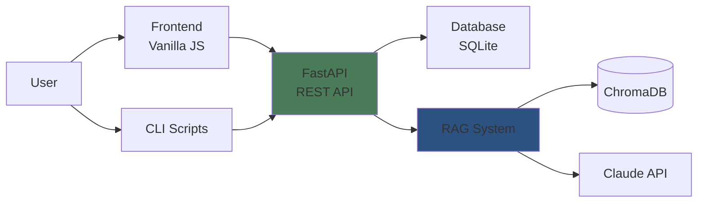

# Getting Started Overview

This guide will help you understand and set up Poolula Platform for managing your LLC's financial records and compliance obligations.

## What You'll Build

By the end of this guide, you'll have a working system that can:

1. **Answer business questions** using natural language
2. **Track transactions** from Airbnb and other sources
3. **Search documents** for specific information
4. **Monitor compliance** deadlines and obligations
5. **Verify answers** through evaluation harness

## Prerequisites

Before you begin, ensure you have:

### Required

- **Python 3.13+** - Latest Python version
- **uv package manager** - Fast, modern Python package installer
- **Anthropic API key** - For Claude AI (sign up at [console.anthropic.com](https://console.anthropic.com/))
- **Git** - For version control

### Optional

- **PostgreSQL** - For production deployment (development uses SQLite)
- **Docker** - For containerized deployment

## System Requirements

**Operating Systems:**

- macOS 11+ (Apple Silicon or Intel)
- Linux (Ubuntu 20.04+, Debian 11+)
- Windows 10/11 with WSL2

**Minimum Hardware:**

- 4GB RAM
- 2GB free disk space
- Internet connection (for AI API calls)

**Recommended Hardware:**

- 8GB+ RAM
- 10GB+ free disk space (for document storage and ChromaDB)
- SSD for better database performance

## Architecture at a Glance



**Key Components:**

1. **Frontend** - Web interface with persona-based help sections
2. **FastAPI** - REST API serving data and AI responses
3. **SQLite** - Local database for transactions, properties, documents, obligations
4. **RAG System** - Combines database queries + document search
5. **ChromaDB** - Vector store for semantic document search
6. **Claude API** - AI model for natural language understanding

## Workflow Overview

### 1. Import Data

```bash
# Import Airbnb transactions
uv run python scripts/import_airbnb_transactions.py \
    --csv data/airbnb_export.csv \
    --property-id <uuid>

# Import expenses
uv run python scripts/import_expenses.py \
    --csv data/expenses.csv \
    --property-id <uuid>
```

### 2. Ingest Documents

```bash
# Ingest all business documents
uv run python scripts/ingest_documents.py

# Ingest specific directory
uv run python scripts/ingest_documents.py \
    --directory documents/formation
```

### 3. Seed Obligations

```bash
# Create common compliance deadlines
uv run python scripts/seed_obligations.py --year 2025
```

### 4. Query Data

**Via CLI:**
```bash
uv run python scripts/cli.py chat
> What was my rental income in August 2025?
```

**Via Web Interface:**
```bash
# Start API server
uv run uvicorn apps.api.main:app --reload --port 8082

# Open browser to http://localhost:8082
```

**Via API:**
```bash
curl -X POST http://localhost:8082/api/query \
  -H "Content-Type: application/json" \
  -d '{"query": "What was my rental income in August 2025?"}'
```

## Directory Structure

Understanding the project layout:

```
poolula-platform/
├── apps/               # Application modules
│   ├── api/           # FastAPI REST API
│   ├── chatbot/       # RAG system (AI + search)
│   └── evaluator/     # Quality assurance
├── core/              # Platform foundation
│   └── database/      # Models, migrations, connection
├── scripts/           # Utility scripts
│   ├── cli.py         # Interactive chatbot CLI
│   ├── import_*.py    # Data import scripts
│   ├── ingest_*.py    # Document ingestion
│   └── seed_*.py      # Database seeding
├── frontend/          # Web interface (vanilla JS)
├── documents/         # Business documents (NOT git tracked)
├── data/              # Data files
│   └── templates/     # CSV templates (git tracked)
├── docs/              # Documentation (this site)
└── tests/             # Test suite
```

## Configuration Files

Key files to understand:

- **`.env`** - Environment variables (API keys, database URL)
- **`pyproject.toml`** - Python dependencies and project metadata
- **`mkdocs.yml`** - Documentation site configuration
- **`alembic.ini`** - Database migration configuration

## Next Steps

Now that you understand the basics, proceed to:

1. **[Installation Guide](installation.md)** - Set up the platform
2. **[Quick Start](quick-start.md)** - Run your first queries
3. **[Chatbot Guide](../user-guide/chatbot.md)** - Learn to use the AI assistant

## Common Questions

??? question "Do I need to know Python?"
    Not for basic use. The chatbot CLI and web interface work without programming knowledge. However, Python skills are helpful for customizing import scripts or extending functionality.

??? question "Can I use this without Claude API?"
    No, the chatbot requires Claude API for natural language understanding. However, you can still use the database and API endpoints without the chatbot features.

??? question "Is my data secure?"
    All data is stored locally in SQLite. Documents and financial data never leave your machine unless you explicitly deploy to a remote server. The only external API calls are to Claude for AI responses.

??? question "Can I host this on a server?"
    Yes! The platform can run on any server with Python 3.13+. For production, we recommend PostgreSQL instead of SQLite and proper authentication/authorization.

## Getting Help

If you run into issues:

1. Check the [FAQ](../faq.md)
2. Review the [Installation Guide](installation.md)
3. Check the [API Reference](../api/overview.md)
4. Open a [GitHub Issue](https://github.com/dagny099/poolula-platform/issues)

---

**Ready to install?** → [Installation Guide](installation.md)
