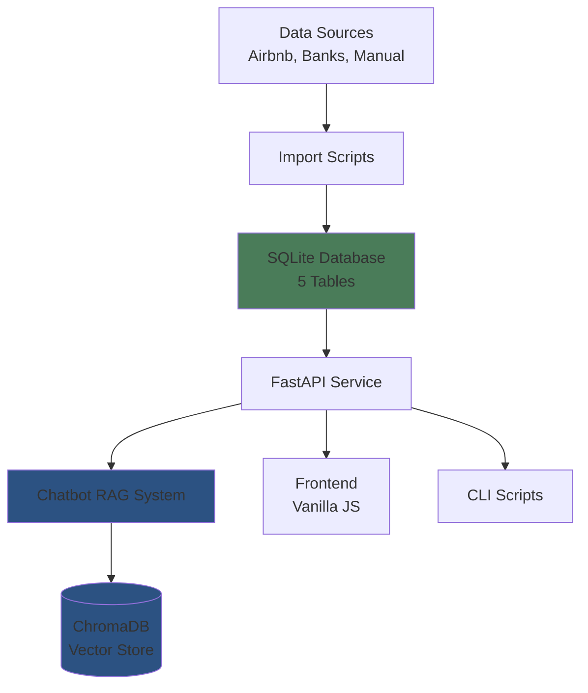

# Poolula Platform Documentation

Welcome to the Poolula Platform documentation. This system provides integrated property management, financial tracking, and compliance tools for Poolula LLC, a Colorado-based rental property business.

## What is Poolula Platform?

Poolula Platform is a data hub and natural language query system that combines:

- **Transaction Analysis** - Automated categorization and querying of rental income, expenses, and capital transactions
- **LLC Compliance Q&A** - AI-powered assistant for answering questions about formation documents, operating agreements, insurance, leases, and tax obligations
- **Verification System** - Rigorous evaluation harness to validate AI responses against known correct answers

## Key Features

### 🤖 AI-Powered Chatbot
Natural language interface for querying business data and documents:

- Ask questions like "What was my rental income in August 2025?"
- Search formation documents, operating agreements, and compliance records
- Get answers backed by database queries and document citations
- 4 persona-based help sections (LLC Owner, Bookkeeper, Property Manager, Compliance Officer)

### 📊 Transaction Management
Financial tracking:

- Import transactions from Airbnb CSV exports; bank statement and receipt import planned
- 30+ predefined expense categories (manual selection; auto-categorization not yet implemented)
- Accrual accounting support for Airbnb transactions
- Full provenance tracking (data lineage for all transactions)

### 📝 Document Management
Organized document storage and semantic search:

- Store and search LLC formation documents, insurance policies, leases, tax documents
- ChromaDB vector store for semantic document search
- Metadata tracking (doc_type, effective_date, version, confidentiality)

### ✅ Compliance Tracking
Track your compliance deadlines:

- Track LLC compliance obligations (Colorado periodic report, tax deadlines, insurance renewal)
- Configurable lead-time field (`reminder_days_before`) for advance notice; automated notification dispatch is planned (Phase 5)
- Recurring obligation support (yearly, quarterly, monthly)

### 🔍 Evaluation & Quality Assurance
Verify AI accuracy with dual specialized evaluators:

- **General evaluator**: 5 cross-domain business questions
- **Airbnb evaluator**: 15 rental income questions with CSV ground truth validation
- Multi-dimensional scoring (tool usage, content relevance, numerical accuracy checks)
- Multi-provider comparison (Anthropic, OpenAI, Ollama)
- Target: ≥90% overall accuracy (not yet measured against production; see [Results](evaluation/results.md))

## Quick Links

-   :material-rocket-launch:{ .lg .middle } __Getting Started__

    ---

    Install Poolula Platform and run your first query

    [:octicons-arrow-right-24: Installation Guide](getting-started/installation.md)

-   :material-chat:{ .lg .middle } __Using the Chatbot__

    ---

    Learn how to ask questions and interpret AI responses

    [:octicons-arrow-right-24: Chatbot Guide](user-guide/chatbot.md)

-   :material-api:{ .lg .middle } __API Reference__

    ---

    Complete API documentation for all endpoints

    [:octicons-arrow-right-24: API Docs](api/overview.md)

-   :material-frequently-asked-questions:{ .lg .middle } __FAQ__

    ---

    Common questions and troubleshooting

    [:octicons-arrow-right-24: FAQ](faq.md)

## Architecture Overview

Poolula Platform uses a hybrid architecture:

**Core Components:**

- **SQLite Database** - Single source of truth for transactions, properties, documents, obligations
- **FastAPI Service** - REST API for all operations
- **RAG System** - Retrieval-Augmented Generation combining database queries + document search
- **ChromaDB** - Vector store for semantic document search
- **Vanilla JS Frontend** - Clean, framework-free web interface

## Technology Stack

**Backend:**

- Python 3.13+ with `uv` package manager
- FastAPI (REST API)
- SQLModel (SQLAlchemy + Pydantic ORM)
- ChromaDB (vector embeddings)
- Anthropic Claude API (Sonnet 4.5 model)

**Frontend:**

- Vanilla JavaScript (no framework dependencies)
- HTML5 + CSS3
- Marked.js (markdown rendering)

**Testing & Quality:**

- pytest (≥80% coverage target)
- Evaluation harness (≥90% AI accuracy target)

## Project Status

**Current Phase:** Phase 6-7 - DSPy/MLflow Integration

!!! info "Current Phase Status"
    **✅ Phase 0-2: Complete** - Infrastructure, database, REST API (properties + chat), RAG chatbot with Anthropic Claude, evaluation harnesses, vanilla JS frontend

    **🚧 Phase 6-7: In Progress** - DSPy/MLflow Integration
    - Baseline RAG implementation with feature-flag wiring ✅
    - MLflow experiment tracking scaffolding ✅
    - True DSPy pipeline (retriever/reasoner/verifier modules) - **Next**
    - Cross-provider optimization and evaluation - Planned

    **📝 Phase 3-5: Future** - Additional REST endpoints (transactions, documents, obligations CRUD), production hardening, advanced analytics

**Completed:**

✅ Database schema (5 core tables with full provenance tracking)
✅ SQLModel models with migrations (Alembic)
✅ FastAPI REST API (properties and chat endpoints operational)
✅ Database query tool (SELECT-only, safe SQL generation)
✅ RAG chatbot with Anthropic Claude (multi-provider support planned Phase 6-7)
✅ Chatbot with conversation history and audit logging
✅ Airbnb CSV import with accrual accounting and duplicate detection
✅ Vanilla JavaScript frontend with 4 persona sections
✅ Document ingestion with ChromaDB vector store
✅ Dual evaluation harnesses:
  - General business evaluator (5 questions)
  - Airbnb income evaluator (15 questions with CSV ground truth)
✅ MkDocs documentation site (46+ pages)
✅ 15 utility scripts for data management and evaluation

**In Progress (Phase 6-7):**

!!! warning "DSPy Implementation Status"
    **Current State:** The DSPy integration scaffolding exists (`apps/dspy/` directory) but the current implementation is a **RAG wrapper baseline**, not a true DSPy pipeline.

    **What Exists:**
    - ✅ DSPy dependency installed and configured (`dspy-ai==2.5.0`)
    - ✅ Feature-flag wiring in API to toggle DSPy vs. baseline
    - ✅ MLflow tracking scaffolding and artifact logging
    - ✅ Evaluation harness for baseline vs. DSPy comparison
    - ✅ Dataset manifest and snapshot utilities

    **What's Next (True DSPy Pipeline):**
    - Implement DSPy modules: Retriever → Reasoner → Verifier
    - Replace RAG wrapper with actual DSPy `Program` classes
    - Add retrieval/reasoning/verification as separate DSPy signatures
    - Enable DSPy self-optimization and compilation
    - Extend evaluation metrics beyond token hit-rate heuristics

    **Detailed Roadmap:** See [`docs/planning/dspy-mlflow-plan-2025-12-09.md`](planning/dspy-mlflow-plan-2025-12-09.md) for complete implementation plan and architecture diagrams.

- Multi-provider LLM support (OpenAI, Ollama) - Planned Phase 6-7
- Cross-provider optimization and comparison

**Next Steps:**

- Complete remaining API endpoints (transactions, documents, obligations)
- Expand test coverage (≥80% target)
- Production hardening (authentication, field validation)

## Getting Help

- **Installation Issues:** See [Installation Guide](getting-started/installation.md)
- **API Questions:** See [API Reference](api/overview.md)
- **General Questions:** See [FAQ](faq.md)
- **Bug Reports:** [GitHub Issues](https://github.com/dagny099/poolula-platform/issues)

---

**Last Updated:** 2026-01-07
**Version:** 0.2.0
**Status:** Active Development (Phase 6-7: DSPy/MLflow Integration)
