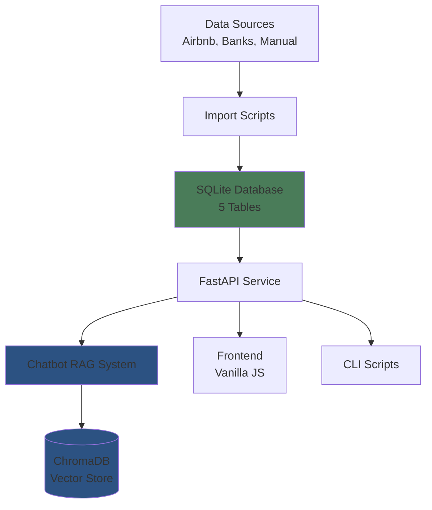

# Poolula Platform Documentation

Welcome to the Poolula Platform documentation. This system provides integrated property management, financial tracking, and compliance tools for Poolula LLC, a Colorado-based rental property business.

## What is Poolula Platform?

Poolula Platform is a data hub and natural language query system that combines:

- **Transaction Analysis** - Automated categorization and querying of rental income, expenses, and capital transactions
- **LLC Compliance Q&A** - AI-powered assistant for answering questions about formation documents, operating agreements, insurance, leases, and tax obligations
- **Verification System** - Rigorous evaluation harness to validate AI responses against known correct answers

## Key Features

### 🤖 AI-Powered Chatbot
Natural language interface for querying business data and documents:

- Ask questions like "What was my rental income in August 2025?"
- Search formation documents, operating agreements, and compliance records
- Get answers backed by database queries and document citations
- 4 persona-based help sections (LLC Owner, Bookkeeper, Property Manager, Compliance Officer)

### 📊 Transaction Management
Comprehensive financial tracking:

- Import transactions from Airbnb, bank statements, and expense receipts
- Automated categorization with 30+ expense categories
- Accrual accounting support
- Full provenance tracking (data lineage for all transactions)

### 📝 Document Management
Organized document storage and semantic search:

- Store and search LLC formation documents, insurance policies, leases, tax documents
- ChromaDB vector store for semantic document search
- Metadata tracking (doc_type, effective_date, version, confidentiality)

### ✅ Compliance Tracking
Never miss a deadline:

- Track LLC compliance obligations (Colorado periodic report, tax deadlines, insurance renewal)
- Automated reminders
- Recurring obligation support (yearly, quarterly, monthly)

### 🔍 Evaluation & Quality Assurance
Verify AI accuracy:

- Golden question set with expected answers
- Multi-dimensional scoring (tool usage, content relevance, numerical accuracy)
- Target: ≥90% accuracy

## Quick Links

-   :material-rocket-launch:{ .lg .middle } __Getting Started__

    ---

    Install Poolula Platform and run your first query

    [:octicons-arrow-right-24: Installation Guide](getting-started/installation.md)

-   :material-chat:{ .lg .middle } __Using the Chatbot__

    ---

    Learn how to ask questions and interpret AI responses

    [:octicons-arrow-right-24: Chatbot Guide](user-guide/chatbot.md)

-   :material-api:{ .lg .middle } __API Reference__

    ---

    Complete API documentation for all endpoints

    [:octicons-arrow-right-24: API Docs](api/overview.md)

-   :material-frequently-asked-questions:{ .lg .middle } __FAQ__

    ---

    Common questions and troubleshooting

    [:octicons-arrow-right-24: FAQ](faq.md)

## Architecture Overview

Poolula Platform uses a hybrid architecture:

**Core Components:**

- **SQLite Database** - Single source of truth for transactions, properties, documents, obligations
- **FastAPI Service** - REST API for all operations
- **RAG System** - Retrieval-Augmented Generation combining database queries + document search
- **ChromaDB** - Vector store for semantic document search
- **Vanilla JS Frontend** - Clean, framework-free web interface

## Technology Stack

**Backend:**

- Python 3.13+ with `uv` package manager
- FastAPI (REST API)
- SQLModel (SQLAlchemy + Pydantic ORM)
- ChromaDB (vector embeddings)
- Anthropic Claude API (Sonnet 4.5 model)

**Frontend:**

- Vanilla JavaScript (no framework dependencies)
- HTML5 + CSS3
- Marked.js (markdown rendering)

**Testing & Quality:**

- pytest (≥80% coverage target)
- Evaluation harness (≥90% AI accuracy target)

## Project Status

**Current Phase:** Week 1.5 - MkDocs Pilot

**Completed:**

✅ Database schema (5 core tables)
✅ SQLModel models with provenance tracking
✅ FastAPI REST API (properties, transactions, documents, obligations, chat endpoints)
✅ Database query tool (SELECT-only, safe queries)
✅ RAG system integration (database + document search)
✅ Chatbot CLI with source citations
✅ Airbnb CSV import with accrual accounting
✅ Vanilla JS frontend with 4 persona sections
✅ Document ingestion script
✅ Sample questions document (133 questions)
✅ Obligations seeding script

**Next Steps:**

- Expand evaluation set (15 → 40 questions)
- Improve evaluation metrics
- Build evaluation reporting dashboard
- Achieve ≥90% evaluation score

## Getting Help

- **Installation Issues:** See [Installation Guide](getting-started/installation.md)
- **API Questions:** See [API Reference](api/overview.md)
- **General Questions:** See [FAQ](faq.md)
- **Bug Reports:** [GitHub Issues](https://github.com/dagny099/poolula-platform/issues)

---

**Last Updated:** 2024-11-14
**Version:** 0.1.0
**Status:** Active Development
