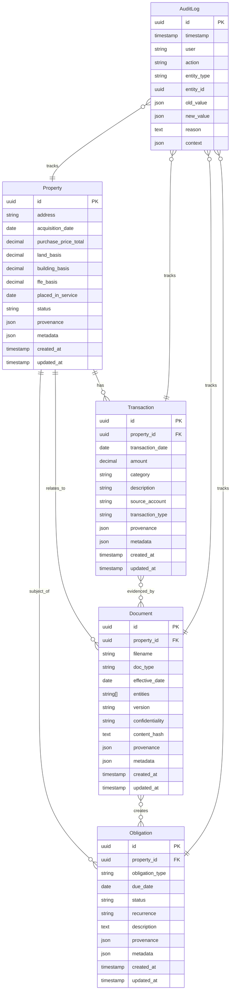

# Poolula Platform - Implementation Plan (Revised)

**Date**: November 13, 2025
**Status**: Approved - Implementation Starting
**Architecture**: Hybrid Data-First Modular Monolith + Workflow UI Layer

---

## Executive Summary

This is the **approved implementation plan** for Poolula Platform, a unified management system for Poolula LLC operations. The plan is **realistically scoped** for solo development with quantitative success criteria and explicit risk mitigation.

**Key Characteristics**:
- Small deployment scale (1-few users, not production enterprise)
- SQLite → PostgreSQL migration path when needed
- Neo4j as optional learning track (Phase 7+)
- Inline code documentation (MkDocs later)
- Legacy systems run in parallel until validated

**Timeline**: 8-16 weeks across 6 phases (Phase 7+ flexible)

---

## Core Principles

1. **UNDERSTANDING**: Explicit models, traceable calculations, step-by-step workflows
2. **TRANSPARENCY**: Provenance tracking, audit logs, source citations
3. **USER FRIENDLINESS**: Task-based navigation, progressive disclosure, guided wizards

---

## Data Model

### Entity Relationship Diagram



### Key Design Decisions

**Provenance**: Embedded as JSON column (not separate table) for performance
```json
{
  "source_type": "csv_import",
  "source_id": "airbnb_nov_2024.csv",
  "source_field": "row_15",
  "created_at": "2024-11-13T10:30:00Z",
  "created_by": "system:importer",
  "confidence": 1.0,
  "verification_status": "unverified"
}
```

**Transaction.category**: Enum from chart of accounts (defined in Phase 1)

**Document.entities**: Standardized array format with validation

**Obligation.recurrence**: RRULE format (iCalendar standard)

---

## Phase 0: Infrastructure Setup (1-2 days)

**Goal**: Set up development environment and safety nets

### Tasks

- [x] Create repository structure
- [ ] Create backup strategy script
- [ ] Set up structured logging
- [ ] Create development runbook
- [ ] Document deployment procedure
- [ ] Set up health check monitoring

### Backup Strategy

```python
# scripts/backup.py
"""
Daily automated backups of SQLite database
Retention: 7 daily, 4 weekly, 12 monthly
"""
```

### Logging Infrastructure

```python
# core/logging_config.py
"""
Structured logging with:
- JSON format for parsing
- Log rotation (10MB files, keep 5)
- Levels: DEBUG (dev), INFO (prod)
- Context: request_id, user, timestamp
"""
```

### Deliverable

✅ Can confidently break things knowing we can recover
✅ Logs are queryable and useful
✅ Health checks verify system status

---

## Phase 1: Foundation (Weeks 1-2)

**Goal**: Build data layer with embedded provenance

### Tasks

#### Week 1: Schema & Models
- [ ] Define chart of accounts (Transaction categories)
- [ ] Design database schema with ERD
- [ ] Implement SQLModel models:
  - `Property` with provenance, metadata
  - `Transaction` with category enum
  - `Document` with entities array
  - `Obligation` with RRULE recurrence
  - `AuditLog` for all mutations
- [ ] Create Alembic migration setup
- [ ] Write provenance helper functions
- [ ] Implement audit log service

#### Week 2: API & Testing
- [ ] Build repository pattern (base + concrete repos)
- [ ] Create FastAPI app structure
- [ ] Implement API endpoints:
  - `POST /api/properties` - Create property
  - `GET /api/properties/{id}` - Get property
  - `PUT /api/properties/{id}` - Update property
  - `GET /api/properties` - List properties
  - (Same pattern for transactions, documents, obligations)
- [ ] Write comprehensive tests (target: ≥80% coverage)
- [ ] Build seed script: `poolula_facts.yml` → SQL
- [ ] Validation: All CRUD operations work

### Chart of Accounts

```python
class TransactionCategory(str, Enum):
    """Categories for transaction classification"""
    # Revenue
    RENTAL_INCOME = "rental_income"

    # Operating Expenses
    UTILITIES_GAS = "utilities:gas"
    UTILITIES_WATER = "utilities:water"
    UTILITIES_ELECTRIC = "utilities:electric"
    UTILITIES_INTERNET = "utilities:internet"
    REPAIRS_MAINTENANCE = "repairs_maintenance"
    INSURANCE = "insurance"
    PROPERTY_TAXES = "property_taxes"
    PROPERTY_MANAGEMENT = "property_management"
    BANK_FEES = "bank_fees"
    PROFESSIONAL_FEES = "professional_fees"

    # Capital
    CAPITAL_IMPROVEMENT = "capital_improvement"
    FURNITURE_FIXTURES = "furniture_fixtures"
    BASIS_ADJUSTMENT = "basis_adjustment"

    # Member Transactions
    MEMBER_CONTRIBUTION = "member_contribution"
    MEMBER_DISTRIBUTION = "member_distribution"

    # Other
    UNCATEGORIZED = "uncategorized"
```

### Success Criteria (Quantitative)

- [ ] ≥80% code coverage on `core/` module
- [ ] All 4 entity tables functional (Property, Transaction, Document, Obligation)
- [ ] Seed script successfully migrates all data from poolula_facts.yml
- [ ] API response time <100ms for single-entity GET (local)
- [ ] Audit log captures 100% of mutations (tested)
- [ ] Zero SQL injection vulnerabilities (parameterized queries only)

### Deliverable

✅ Working API with CRUD operations
✅ All tests green
✅ Provenance auto-populated on all inserts
✅ Audit log tracks all changes

---

## Phase 2: Integrate Chatbot (Weeks 3-4)

**Goal**: Move RAG system, add SQL query capability, validate with evaluation

### Tasks

#### Week 3: Integration
- [ ] Copy RAG codebase to `apps/chatbot/`
- [ ] Update imports and directory structure
- [ ] Migrate 32 existing tests to new structure
- [ ] Connect to audit log (log every Q&A pair)

#### Week 4: Enhancement & Validation
- [ ] Build database query tool for Claude:
  ```python
  def query_database(query_description: str) -> dict:
      """
      Safe SQL query execution (SELECT only, parameterized)

      Args:
          query_description: Natural language description of what to query

      Returns:
          Query results as list of dicts with metadata
      """
  ```
- [ ] Enhance search tools to hybrid (vector + SQL)
- [ ] **Run evaluation harness immediately**:
  - Load `poolula_eval_set.jsonl`
  - Execute against chatbot
  - Generate score report
- [ ] Tune prompts/tools based on evaluation results
- [ ] Re-run until ≥90% accuracy achieved

### Success Criteria (Quantitative)

- [ ] All 32 legacy tests passing in new structure
- [ ] **Evaluation score ≥90%** on golden set (25-50 questions)
- [ ] **Zero critical failures** on high-sensitivity questions
- [ ] Chatbot can answer ≥5 SQL-backed questions correctly:
  - "What was my Q3 revenue?"
  - "Show me all utilities expenses in October"
  - "What's my depreciable basis?"
  - "When is my next compliance obligation?"
  - "How many transactions are uncategorized?"
- [ ] Response time <3s P95 (95th percentile)
- [ ] Hybrid queries work (SQL + documents): "Show revenue per operating agreement terms"

### Risk Mitigation

- Keep legacy RAG system running until evaluation passes
- Document any failing questions, iterate on tools/prompts
- If stuck below 90%, defer integration and replan

### Deliverable

✅ Chatbot answers both DB-backed and document-backed questions
✅ Passes evaluation harness with ≥90% score
✅ All questions logged to audit trail

---

## Phase 3: Integrate Dashboard (Week 5)

**Goal**: Migrate Airbnb data to SQL, keep Streamlit UI

### Tasks

- [ ] Build CSV importer service:
  ```python
  def import_airbnb_csv(file: Path, property_id: UUID) -> ImportResult:
      """
      Parse Airbnb CSV, validate data, insert into Transaction table

      Returns:
          - rows_imported: int
          - rows_skipped: int
          - errors: list[str]
          - provenance_id: str
      """
  ```
- [ ] Import historical Airbnb CSV data (test with existing file)
- [ ] Build analytics API endpoints:
  - `GET /api/analytics/revenue?start_date=...&end_date=...`
  - `GET /api/analytics/bookings?property_id=...`
  - `GET /api/analytics/occupancy?year=...`
- [ ] Update Streamlit dashboard to call new API (replace pandas in-memory)
- [ ] Add provenance to all metrics
- [ ] Embed Streamlit in iframe (temporary, until Phase 4 rewrite)
- [ ] Run comparison report (legacy vs new calculations)

### Success Criteria (Quantitative)

- [ ] 100% of Airbnb CSV data successfully imported with validation
- [ ] All dashboard metrics match legacy calculations (within $0.01 tolerance)
- [ ] Dashboard load time <2s
- [ ] CSV upload processing time <5s for typical file (50-100 rows)
- [ ] Zero data loss (all CSV rows accounted for: imported or flagged as errors)

### Risk Mitigation

- Keep legacy Streamlit version side-by-side for 1 month
- Run daily comparison reports (legacy metrics vs SQL-backed metrics)
- Document any discrepancies, investigate before declaring complete

### Deliverable

✅ Dashboard shows live SQL data
✅ CSV uploads persist to database
✅ Provenance shows "from airbnb_nov_2024.csv" on all imported transactions

---

## Phase 4: Frontend Unification (Weeks 6-7)

**Goal**: Build Vue 3 shell BEFORE adding more features

### Tasks

#### Week 6: Foundation
- [ ] Create Vue 3 + Vite project (`frontend/`)
- [ ] Set up Pinia stores:
  - `propertyStore.ts` (CRUD operations)
  - `transactionStore.ts`
  - `uiStore.ts` (navigation, modals, toast notifications)
- [ ] Design navigation structure (sidebar + top bar)
- [ ] Build reusable components:
  - `DataTable.vue` (sortable, filterable, paginated)
  - `MetricCard.vue` (with tooltip showing provenance)
  - `ProvenanceViewer.vue` (modal showing source lineage)
  - `AuditTrail.vue` (timeline of changes)
  - `FormField.vue` (consistent styling, validation)

#### Week 7: Pages & Workflow
- [ ] Implement pages:
  - `Home.vue` (task cards: "What do you want to do?")
  - `Ask.vue` (chat interface - port from existing chatbot UI)
  - `Analyze.vue` (dashboard - embed Streamlit initially OR rewrite charts)
  - `Evaluate.vue` (harness results - placeholder for Phase 6)
  - `Settings.vue` (configuration, about)
- [ ] Build workflow framework:
  - `Workflow.vue` (progress indicator, step navigation, cancel/save)
  - `WorkflowStep.vue` (content area with validation)
- [ ] Proof-of-concept workflow: "Review Transactions"
  - Step 1: Select date range → loads uncategorized transactions
  - Step 2: Review/categorize → table with inline category dropdown
  - Step 3: Confirm changes → shows summary, "Save All" button
- [ ] Progressive disclosure implementation:
  - Click metric → expandable card with breakdown
  - Click "source" icon → provenance modal
  - Click "history" icon → audit trail modal

### Success Criteria (Quantitative)

- [ ] All existing features accessible through Vue UI
- [ ] Time to Interactive <2s (Lighthouse)
- [ ] Lighthouse score ≥90 (performance, accessibility, best practices, SEO)
- [ ] Mobile responsive (works on tablet, 768px+ width)
- [ ] Zero console errors or warnings
- [ ] "Review Transactions" workflow functional end-to-end

### Deliverable

✅ Unified Vue app with working chat, dashboard, and first workflow
✅ Consistent UX patterns across all pages
✅ Provenance and audit trail accessible from any data point

---

## Phase 5: Core Feature Expansion (Weeks 8-16)

**Goal**: Add high-value tools now that infrastructure is solid

### 1. Compliance Calendar (Weeks 8-9)

**Features**:
- Obligation tracking dashboard (calendar view + list view)
- Create/edit obligations (one-time or recurring with RRULE)
- Status management (pending → completed → overdue)
- Email reminders (optional, via SendGrid or similar)
- Link obligations to documents that created them

**API Endpoints**:
- `GET /api/obligations?status=pending&due_before=...`
- `POST /api/obligations` - Create obligation
- `PATCH /api/obligations/{id}/complete` - Mark complete
- `GET /api/obligations/upcoming` - Next 30 days

**Success Criteria**:
- [ ] Can create recurring obligation (e.g., "CO periodic report, every April 1")
- [ ] Calendar view shows all obligations
- [ ] Overdue obligations highlighted in red
- [ ] Email reminder sent 7 days before due date (if configured)

---

### 2. Document Vault (Weeks 10-11)

**Features**:
- Upload documents (drag-and-drop)
- OCR for scanned PDFs (using pytesseract or similar)
- Version tracking (upload new version, keep history)
- Link documents to transactions, obligations, properties
- Search documents by type, date, entity, or full-text

**API Endpoints**:
- `POST /api/documents/upload` - Upload with metadata
- `GET /api/documents/{id}/versions` - Get version history
- `GET /api/documents/{id}/ocr` - Trigger OCR
- `GET /api/documents/search?q=...&doc_type=...`

**Success Criteria**:
- [ ] Can upload PDF, extract text automatically
- [ ] OCR works on scanned images (≥80% accuracy on clear scans)
- [ ] Version history shows who uploaded when
- [ ] Full-text search returns relevant documents

---

### 3. Expense Categorization (Weeks 12-13)

**Features**:
- Import bank statements (CSV from Chase, NuVista)
- AI-powered categorization (Claude with few-shot examples)
- Review/approval workflow (bulk approve or edit)
- Learn from corrections (store examples for future)
- Bulk operations (categorize similar, split transactions)

**API Endpoints**:
- `POST /api/transactions/import-bank-csv` - Import bank statement
- `POST /api/transactions/categorize-ai` - AI categorization
- `POST /api/transactions/bulk-update` - Apply category to multiple

**Workflow**:
1. Upload bank CSV
2. System auto-categorizes using AI + past patterns
3. User reviews suggestions (green = confident, yellow = uncertain)
4. User approves or corrects
5. System learns from corrections

**Success Criteria**:
- [ ] Can import Chase and NuVista CSV formats
- [ ] AI achieves ≥80% accuracy on initial categorization
- [ ] Bulk approve workflow works smoothly
- [ ] Learning improves accuracy over time (measure monthly)

---

### 4. Tax Assistant (Weeks 14-16)

**Features**:
- Depreciation calculator (27.5-year residential rental)
- Form 1065 data preparation wizard
- Schedule E generator (rental income/expenses)
- K-1 calculator (member distributions)
- Export to tax software format (CSV, PDF)

**Workflows**:
- "Calculate Depreciation" → Walks through basis, placed-in-service date, generates schedule
- "Prepare Form 1065" → Collects data, generates fillable PDF
- "Generate Schedule E" → Aggregates rental income/expenses, exports

**API Endpoints**:
- `POST /api/tax/depreciation` - Calculate depreciation schedule
- `GET /api/tax/1065-data?year=2024` - Collect Form 1065 data
- `GET /api/tax/schedule-e?year=2024` - Generate Schedule E

**Success Criteria**:
- [ ] Depreciation calculation matches IRS Pub 527 guidelines
- [ ] Form 1065 data export includes all required fields
- [ ] Schedule E sums match QuickBooks (if cross-checking)
- [ ] Exports are CPA-ready (no manual cleanup needed)

---

## Phase 6: Evaluation Harness Dashboard (Week 17)

**Goal**: Build UI for monitoring chatbot quality over time

### Tasks

- [ ] Build evaluation results page:
  - Score trending chart (line graph over time)
  - Per-question breakdown table (pass/fail, score, last run)
  - Critical failure alerts (red banner if any)
  - Regex editor (edit accept_regex for questions)
- [ ] "Run Evaluation" button (triggers harness, shows progress)
- [ ] Compare runs (diff between two evaluation runs)
- [ ] CI integration (GitHub Actions runs evaluation on PR)
- [ ] Slack/email notification on failure (optional)

### Success Criteria

- [ ] Can view evaluation history over time
- [ ] Can identify which questions are failing
- [ ] Can re-run evaluation on demand (<2 min)
- [ ] CI blocks merge if evaluation score <90%

### Deliverable

✅ Evaluation dashboard with trending
✅ Automated testing in CI
✅ Alerts on regression

---

## Phase 7+: Neo4j Integration (Flexible Timing)

**Goal**: Add graph database for relationship exploration and learning

**Important**: This is a **learning track**, not critical path. Can start anytime after Phase 3.

### Approach

Build Neo4j sync as **separate service** that doesn't break existing features. SQL remains source of truth.

### Tasks

- [ ] Set up Neo4j (Docker container)
- [ ] Design graph schema:
  ```cypher
  // Nodes
  (:Property {id, address, ...})
  (:Transaction {id, date, amount, category, ...})
  (:Document {id, filename, doc_type, ...})
  (:Obligation {id, type, due_date, ...})

  // Relationships
  (Property)-[:HAS_TRANSACTION]->(Transaction)
  (Property)-[:HAS_DOCUMENT]->(Document)
  (Document)-[:EVIDENCES]->(Transaction)
  (Document)-[:CREATES]->(Obligation)
  (Transaction)-[:PART_OF_WORKFLOW]->(Transaction)
  ```
- [ ] Build sync service:
  - Listen to SQLAlchemy events (after_insert, after_update, after_delete)
  - Update Neo4j graph in real-time
  - Handle conflicts/retries (idempotent operations)
  - Rebuild from SQL if Neo4j gets out of sync
- [ ] Create graph query service:
  - Cypher query builder (parameterized, safe)
  - Common queries as reusable functions:
    - `get_related_entities(entity_id, depth=2)`
    - `trace_provenance(data_id)`
    - `impact_analysis(field_name)`
    - `timeline(property_id, start_date, end_date)`
- [ ] Build visual graph explorer UI:
  - Interactive graph (D3.js or vis.js)
  - "Show me everything related to..." search
  - Click node → expand relationships
  - Color-code by entity type
- [ ] Add graph-specific API endpoints:
  - `GET /api/graph/explore/{entity_id}?depth=2`
  - `GET /api/graph/provenance/{data_id}`
  - `GET /api/graph/impact/{field}`
  - `GET /api/graph/timeline/{property_id}?start=...&end=...`

### Example Cypher Queries

```cypher
// "Show me everything related to the property acquisition"
MATCH (p:Property {address: "900 S 9th St"})
MATCH path = (p)-[*1..3]-(related)
WHERE related:Document OR related:Transaction OR related:Obligation
RETURN path

// "How did this basis number get calculated?"
MATCH (p:Property {id: $property_id})
MATCH (t:Transaction {category: "basis_adjustment"})-[:RELATED_TO]->(p)
MATCH (d:Document)-[:EVIDENCES]->(t)
RETURN p, t, d

// "What obligations were created by this lease?"
MATCH (lease:Document {doc_type: "lease"})-[:CREATES]->(o:Obligation)
RETURN lease, o

// "Timeline of all changes to this property"
MATCH (p:Property {id: $property_id})<-[:MODIFIED]-(a:AuditLog)
RETURN a ORDER BY a.timestamp DESC LIMIT 50
```

### Success Criteria

- [ ] Neo4j stays in sync with SQL (within 1 minute lag)
- [ ] Can trace data provenance through graph visually
- [ ] Graph queries <500ms P95
- [ ] Graph UI is intuitive (non-technical user can explore)
- [ ] Rebuild from SQL completes in <5 minutes

### Learning Goals

- Cypher query language proficiency
- Graph modeling patterns (nodes vs properties vs relationships)
- Sync strategies (dual-write, event-driven, eventual consistency)
- Graph visualization techniques
- When to use graph vs relational queries

### Deliverable

✅ Graph database running in parallel
✅ Visual exploration UI
✅ Documented Cypher query patterns

---

## Risk Management

### Technical Risks

| Risk | Probability | Impact | Mitigation |
|------|-------------|--------|------------|
| **Database schema changes mid-project** | Medium | Medium | Use Alembic migrations, version all changes, test rollback procedures |
| **Legacy data inconsistencies** | Medium | Low | Validate during import, flag issues, provide correction UI |
| **API breaking changes** | Low | High | Version APIs (v1, v2), deprecate gradually, document all changes |
| **Frontend-backend contract drift** | Medium | Medium | Use OpenAPI spec, generate TypeScript types, shared Pydantic models |
| **Performance degradation** | Low | Medium | Index database properly (property_id, transaction_date), cache queries, monitor with alerts |
| **Data loss during migration** | Low | Very High | **Backup before each phase**, test restore, keep legacy systems running parallel |

### Business/Process Risks

| Risk | Probability | Impact | Mitigation |
|------|-------------|--------|------------|
| **Scope creep** | High | High | Stick to phased plan, defer "nice-to-haves" to Phase 6+, say no to new features mid-phase |
| **Solo dev burnout** | Medium | Very High | Work sustainable hours (no weekends), celebrate small wins, take breaks |
| **Feature abandonment** | Medium | Medium | Focus on high-value features first (chatbot, dashboard), others are bonus |
| **User adoption friction** | Low | Medium | Keep existing UIs working during transition, provide migration guides, don't force changes |
| **Over-engineering for small deployment** | Medium | Medium | Remember: 1-few users, not enterprise scale. Simple solutions preferred. |

### Data Quality Risks

| Risk | Probability | Impact | Mitigation |
|------|-------------|--------|------------|
| **Provenance tracking overhead** | Low | Low | Make it automatic where possible, UI helpers for manual entry, batch operations |
| **Audit log bloat** | Low | Low | Implement retention policy (1 year detailed, then summarize), archive old logs |
| **Confidence scores misinterpreted** | Medium | Medium | Clear UI labels, tooltips, documentation on what confidence means |
| **Source citation errors** | Low | High | Validate citations automatically, allow user corrections, flag suspicious ones |

---

## Success Metrics Summary

### Phase 1 (Foundation)
- [ ] ≥80% code coverage
- [ ] API response time <100ms
- [ ] Seed script migrates 100% of poolula_facts.yml

### Phase 2 (Chatbot)
- [ ] **Evaluation score ≥90%**
- [ ] **Zero critical failures**
- [ ] Response time <3s P95

### Phase 3 (Dashboard)
- [ ] Metrics match legacy (within $0.01)
- [ ] Dashboard load <2s
- [ ] CSV import <5s

### Phase 4 (Frontend)
- [ ] Time to Interactive <2s
- [ ] Lighthouse score ≥90
- [ ] Mobile responsive (768px+)

### Phase 5 (Features)
- [ ] Each feature has ≥70% code coverage
- [ ] Each workflow completes in <30s
- [ ] User can accomplish task without documentation

### Phase 6 (Evaluation Dashboard)
- [ ] CI runs evaluation automatically
- [ ] Score trends visualized
- [ ] Alerts on regression

### Overall Platform
- [ ] Zero data loss during migration
- [ ] All three core principles demonstrably achieved
- [ ] User can complete end-to-end workflows without friction
- [ ] Documentation complete enough for 6-month-future-you to understand

---

## Timeline Overview

| Phase | Duration | Focus |
|-------|----------|-------|
| Phase 0 | 1-2 days | Infrastructure, backups, logging |
| Phase 1 | 2 weeks | Database, API, provenance |
| Phase 2 | 2 weeks | Chatbot integration, evaluation |
| Phase 3 | 1 week | Dashboard migration |
| Phase 4 | 2 weeks | Vue UI, workflows |
| Phase 5 | 8 weeks | 4 new features |
| Phase 6 | 1 week | Evaluation dashboard |
| **Total** | **16 weeks** | **Core platform complete** |
| Phase 7+ | Flexible | Neo4j (learning track) |

---

## What Makes This Plan Different

**Compared to initial plan**:
- ✅ More realistic timeline (16 weeks vs 6-8)
- ✅ Quantitative success criteria (not vague)
- ✅ Evaluation runs early (Phase 2, not Phase 4)
- ✅ Infrastructure setup explicit (Phase 0)
- ✅ Risk mitigation per phase
- ✅ Parallel legacy systems strategy
- ✅ Small deployment scale acknowledged
- ✅ Neo4j as learning track (not critical path)

**Design refinements**:
- ✅ Embedded provenance (not separate table)
- ✅ Chart of accounts defined upfront
- ✅ RRULE for recurrence (standard format)
- ✅ Explicit entity validation rules

---

## Next Steps

1. ✅ Plan approved and saved
2. ⏭️ Remove old planning document
3. ⏭️ Update README.md
4. ⏭️ Start Phase 0 (backups, logging)
5. ⏭️ Start Phase 1 (pyproject.toml, schema design)

---

**Document Version**: 2.0 (Revised)
**Author**: Collaborative planning session
**Date**: November 13, 2025
**Status**: Approved - Implementation starting
