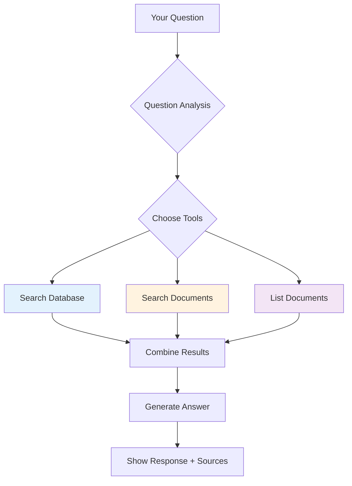

# Using the Chatbot

Complete guide for interacting with the Poolula Platform AI chatbot to get answers about your business, properties, and documents.

## Overview

The Poolula chatbot uses AI-powered search to answer questions by:

1. **Searching your database** for properties, transactions, and financial data
2. **Searching your documents** for formation docs, contracts, and policies
3. **Combining results** to provide comprehensive answers with citations

## Quick Start

### Access the Chatbot

```bash
# 1. Start the API server
uv run uvicorn apps.api.main:app --reload --port 8082

# 2. Open browser
open http://localhost:8082

# 3. Ask a question in the chat interface
```

### First Questions to Try

**Property information:**

- "What is our property address?"
- "What properties do we own?"

**Financial data:**

- "What was my rental income last month?"
- "Show me expenses for this year"

**Documents:**

- "What documents do we have?"
- "What's our business purpose in the operating agreement?"

## How the Chatbot Works



### Behind the Scenes

**1. Your question is analyzed**

- AI determines what type of information you need
- Decides which tools to use (database, documents, or both)

**2. Tools search for relevant information**

- **Database tool**: Queries properties, transactions, obligations
- **Document search**: Finds relevant text in your ingested documents
- **Document list**: Shows available documents

**3. AI generates an answer**

- Combines information from multiple sources
- Provides citations showing where information came from
- Formats answer in clear, natural language

## Types of Questions

### Property Questions

**What you can ask:**

- Property addresses and details
- Acquisition information
- Depreciation basis
- Placed-in-service dates

**Examples:**

```
"What is our property's address?"
→ Searches database for property record

"What is the land basis for our property?"
→ Queries financial data from database

"When was our property placed in service?"
→ Retrieves depreciation start date
```

### Financial Questions

**What you can ask:**

- Rental income and expenses
- Transaction history
- Category breakdowns
- Date-range queries

**Examples:**

```
"What was my rental income in August 2024?"
→ Filters transactions by category and date

"Show me all utility expenses this year"
→ Queries expenses by category

"What were my total expenses in 2024?"
→ Aggregates transaction amounts
```

### Document Questions

**What you can ask:**

- What documents exist
- Content within documents
- Formation details
- Compliance requirements

**Examples:**

```
"What documents do we have?"
→ Lists all ingested documents

"What's our LLC's business purpose?"
→ Searches formation documents

"Who are the members of our LLC?"
→ Searches operating agreement
```

### Hybrid Questions

**What you can ask:**

- Questions combining database + documents
- Cross-referencing multiple sources

**Examples:**

```
"What properties do we own and what documents mention them?"
→ Queries database for properties
→ Searches documents for property references
→ Combines both results

"Show me our EIN and where it's mentioned in our documents"
→ Gets EIN from database
→ Finds document references
```

## Asking Effective Questions

### Be Specific

**Good examples:**

- ✅ "What was my rental income in August 2024?"
- ✅ "Show me utility expenses for this year"
- ✅ "What is our property's land basis?"

**Less effective:**

- ❌ "Tell me about money"
- ❌ "What happened?"
- ❌ "Show me stuff"

### Include Key Details

**Time periods:**

- "in August 2024"
- "for this year"
- "last month"

**Categories:**

- "rental income"
- "utility expenses"
- "property management fees"

**Specific values:**

- "our property's basis"
- "land basis"
- "building depreciation"

### One Question at a Time

**Good:**

```
"What was my rental income in August 2024?"
... get answer ...
"What were my expenses in August 2024?"
```

**Less effective:**

```
"What was my rental income in August 2024 and what were my expenses and
what's my net income and what documents talk about rental properties?"
```

(AI can handle complex questions, but simpler is often better)

## Understanding Responses

### Response Format

Typical response structure:

```
[Answer text with relevant information]

Sources:
- [Source 1: Database query or document reference]
- [Source 2: Additional source if multiple tools used]
```

### Source Citations

**Database sources:**

```
Source: Database Query (properties)
Type: query_database
```

Means: Information came from querying the SQLite database

**Document sources:**

```
Source: Poolula LLC Operating Agreement
Type: search_document_content
Relevance: 0.85
```

Means: Information found in specific document via semantic search

### Interpreting Tool Usage

Look at the sources to understand how your question was answered:

**Database query:**

- Fast, precise answers
- For structured data (properties, transactions, dates, amounts)
- Returns exact values

**Document search:**

- Semantic search through text
- For unstructured information (formation details, agreements, policies)
- Returns relevant passages

**Multiple sources:**

- Hybrid query used multiple tools
- More comprehensive answer
- Cross-referenced information

## Common Question Patterns

### "What" Questions

**Property info:**

- "What is our property address?"
- "What is our EIN number?"

**Financial data:**

- "What was my rental income in [month]?"
- "What were my expenses for [category]?"

### "Show" / "List" Questions

**Transactions:**

- "Show me all expenses in 2024"
- "List rental income by month"

**Documents:**

- "Show me what documents we have"
- "List all formation documents"

### "When" Questions

**Dates and deadlines:**

- "When was our property placed in service?"
- "When is our annual report due?"

### "How much" / "How many" Questions

**Amounts and counts:**

- "How much did we pay in utilities?"
- "How many transactions do we have?"

## Tips for Best Results

### 1. Use Natural Language

You don't need special syntax - just ask naturally:

✅ "What's our property worth?"
✅ "How much rental income did we get last month?"

### 2. Start Broad, Then Narrow

**Strategy:**

```
1. "What documents do we have?"
   → See what's available

2. "What's in our operating agreement?"
   → Search specific document

3. "Who are the members listed in the operating agreement?"
   → Get specific detail
```

### 3. Check Sources

Always review the sources shown with answers:

- Verify information came from correct source
- Note relevance scores for document searches
- Cross-reference if needed

### 4. Rephrase if Needed

If an answer isn't helpful, try rephrasing:

**First try:** "Show me money stuff"
→ Too vague

**Second try:** "What was my rental income last month?"
→ Specific and clear

### 5. Use Context from Previous Questions

The chatbot maintains conversation context:

```
You: "What properties do we own?"
Bot: [Lists 900 S 9th St property]

You: "What's the land basis for that property?"
Bot: [Understands "that property" refers to 900 S 9th St]
```

## Conversation Features

### Session Context

The chatbot remembers previous questions in your conversation:

- References to "that property", "this document", etc. work
- Context helps with follow-up questions
- Maintained per browser session

### New Conversation

Start a new session if:

- Changing topics completely
- Getting confused responses
- Want to clear context

(Refresh the page or use "New Conversation" if available)

## Sample Questions by Persona

See [Sample Questions](../sample-questions.md) for 133 example questions organized by:

**1. New LLC Owner**

- Formation and structure
- Annual compliance
- Basic operations

**2. Bookkeeper**

- Property basis & depreciation
- Transaction analysis
- Chart of accounts

**3. Property Manager**

- Property operations
- Vendor management
- Maintenance tracking

**4. Tax Preparer**

- Depreciation schedules
- Deduction tracking
- Basis calculations
- Tax form preparation

## Limitations & Known Issues

### Current Limitations

**Time-based queries:**

- "last month" works
- Specific months work: "August 2024"
- Relative dates might be less accurate

**Calculations:**

- Basic aggregations work (sum, count)
- Complex calculations may require follow-up
- Tax calculations not automated (yet)

**Document search:**

- Works on ingested documents only
- Scanned PDFs need OCR (not yet implemented)
- Images in documents not searchable

### When Chatbot Can't Help

**For:**

- Creating new records → Use API or manual entry
- Updating data → Use API endpoints
- Deleting information → Use API with caution
- Complex multi-step workflows → Manual process

**Remember:** Chatbot is read-only - it searches and reports, but doesn't modify data.

## Troubleshooting

### No Answer or Empty Response

**Possible causes:**

- No data exists for that query
- Question too vague
- Tool selection error

**Try:**

- Rephrase question more specifically
- Verify data exists (check database or documents)
- Break complex question into simpler parts

### Wrong Information

**If answer seems incorrect:**

1. Check sources shown
2. Verify data in source (database or document)
3. Report issue if source is correct but answer is wrong

### Slow Responses

**Normal response time:** 1-3 seconds

**Slower responses happen when:**

- First query after startup (model loading)
- Complex document searches
- Large date ranges

### Chatbot Not Available

**Check:**

```bash
# Is server running?
curl http://localhost:8082/health

# Start if needed
uv run uvicorn apps.api.main:app --reload --port 8082
```

## Advanced Usage

### Asking About Specific Documents

```
"What's in the Articles of Organization?"
"Search the operating agreement for member information"
"Find insurance policy details in our documents"
```

### Filtering by Date Range

```
"Show transactions between January and March 2024"
"What was rental income from July to September?"
```

### Aggregating Data

```
"Show total expenses by category for 2024"
"Break down rental income by month"
"What's my average monthly income?"
```

## Next Steps

**Learn more:**

- [Managing Documents](document-management.md) - Add more documents for richer answers
- [Sample Questions](../sample-questions.md) - 133 example questions to try
- [Evaluation](../evaluation/index.md) - How we ensure chatbot quality

**For developers:**

- [Evaluation Harness](../evaluation/harness.md) - Testing methodology
- [API Reference](../api/overview.md) - Direct API access
- [Architecture](../architecture/system-design.md) - How it works under the hood
