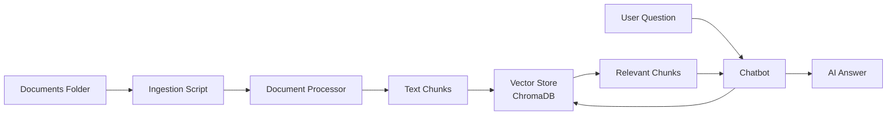

# Document Management Guide

Complete guide for managing business documents in Poolula Platform's AI-powered knowledge base.

## Overview

Poolula Platform uses a **RAG (Retrieval-Augmented Generation)** system to make your business documents searchable through natural language queries. The chatbot can answer questions by searching through your:

- Formation documents (Articles, Operating Agreement)

- Financial statements and accounting notes

- Compliance checklists and reports

- Insurance policies

- Contracts and leases

- Tax documents

**How it works:**



1. **Place documents** in `documents/` folder
2. **Run ingestion** to process and chunk them
3. **Ask questions** via the chatbot
4. **Get answers** with citations

---

## Quick Start

### 1. Place Documents

```bash
# Recommended structure
poolula-platform/
└── documents/
    ├── formation/              # LLC formation docs
    ├── compliance/             # Regulatory filings
    ├── financial/              # Statements, accounting
    ├── contracts/              # Leases, agreements
    ├── insurance/              # Policies
    └── tax/                    # Tax returns, schedules
```

### 2. Ingest Documents

```bash
# Ingest all documents from documents/ folder
uv run python scripts/ingest_documents.py

# Output:
# Processing: documents/formation/Articles.pdf
#   - Extracted 5 chunks
#   ✅ Successfully ingested: Articles.pdf
# ...
# 📊 Ingestion Summary:
#   - Files processed: 8
#   - New documents: 8
#   - Skipped (duplicates): 0
#   - Chunks added: 135
```

### 3. Verify Ingestion

```bash
# List all ingested documents
uv run python scripts/ingest_documents.py --list

# Show detailed statistics
uv run python scripts/ingest_documents.py --stats
```

### 4. Ask Questions

Start the API server and use the chatbot:

```bash
# Start server
uv run uvicorn apps.api.main:app --reload --port 8082

# Navigate to http://localhost:8082
# Ask: "What's the business purpose stated in our LLC formation documents?"
```

---

## Document Organization

### Supported File Types

| Extension | Type | Notes |
|-----------|------|-------|
| `.pdf` | PDF Documents | Full text extraction |
| `.docx` | Word Documents | Text and formatting |
| `.txt` | Plain Text | Direct ingestion |
| `.md` | Markdown | Full support |

### Recommended Folder Structure

```
documents/
├── formation/                  # Core formation documents
│   ├── Articles_of_Organization.pdf
│   ├── Operating_Agreement.pdf
│   └── EIN_Assignment.pdf
├── compliance/                 # Regulatory compliance
│   ├── Annual_Report_2024.pdf
│   └── Business_License.pdf
├── financial/                  # Financial documents
│   ├── Balance_Sheet_2024.pdf
│   └── Accounting_Notes.docx
├── contracts/                  # Legal agreements
│   ├── Lease_900_S_9th.pdf
│   └── Management_Agreement.pdf
├── insurance/                  # Insurance policies
│   ├── Property_Insurance.pdf
│   └── Liability_Policy.pdf
└── tax/                        # Tax filings
    ├── Form_1065_2023.pdf
    └── Tax_Extension_2024.pdf
```

**Tips:**

- Use descriptive filenames (`Articles_of_Organization.pdf` not `doc1.pdf`)

- Include dates in filenames (`Annual_Report_2024.pdf`)

- Avoid special characters and spaces (use underscores)

- Skip README.md files (automatically excluded)

---

## Metadata CSV Guide

### What is the Metadata CSV?

The metadata CSV (`data/document_metadata.csv`) provides **structured information** about your documents to improve search quality and organization.

**Location:** `data/document_metadata.csv`

### Is it Required?

**No!** The system has smart filename-based inference that works well for most documents. However, the CSV provides:

✅ More accurate categorization
✅ Better search results
✅ Cleaner titles in responses
✅ Rich filtering by entity, date, type

### CSV Format

```csv
doc_id,title,doc_type,effective_date,entities,address,version,confidentiality,notes
```

### Field Reference

| Field | Required | Valid Values | Example | Purpose |
|-------|----------|--------------|---------|---------|
| `doc_id` | Yes | Exact filename | `Articles_of_Organization.pdf` | Match to file |
| `title` | Yes | Any string | `Poolula LLC Articles of Organization` | Human-readable name |
| `doc_type` | Yes | See below | `formation` | Document category |
| `effective_date` | No | ISO date (YYYY-MM-DD) | `2024-05-15` | When document takes effect |
| `entities` | No | Comma-separated | `"Poolula LLC, Rosalba Sotelo"` | Related parties |
| `address` | No | Any address | `"900 S 9th St, Montrose, CO"` | Property address |
| `version` | No | draft, final, superseded | `final` | Document status |
| `confidentiality` | No | internal, restricted | `internal` | Access level |
| `notes` | No | Any text | `Filed with Colorado Secretary of State` | Additional context |

### Valid Document Types

| Type | Description | Examples |
|------|-------------|----------|
| `formation` | LLC formation documents | Articles, Operating Agreement, EIN |
| `authority` | Authority statements | Trustee authority, POA |
| `deed` | Property deeds | Warranty deed, quitclaim |
| `insurance` | Insurance policies | Property, liability, auto |
| `banking` | Bank documents | Account statements, credit cards |
| `accounting` | Accounting records | Ledgers, charts of accounts, notes |
| `minutes` | Meeting minutes | Annual meetings, special meetings |
| `consent` | Consent resolutions | Member consent, trustee consent |
| `compliance` | Regulatory compliance | Annual reports, licenses |
| `lease` | Leases and rental agreements | Tenant leases, rental contracts |
| `vendor` | Vendor contracts | Service agreements, contracts |
| `tax` | Tax documents | Form 1065, schedules, extensions |
| `index` | Organizational documents | Table of contents, binder guides |

### Example Metadata CSV

Here's what the metadata CSV looks like for your existing documents:

```csv
doc_id,title,doc_type,effective_date,entities,address,version,confidentiality,notes
240515_Articles_Poolula.pdf,Poolula LLC Articles of Organization,formation,2024-05-15,"Poolula LLC, Hidalgo-Sotelo Living Trust","900 S 9th St, Montrose, CO",final,internal,Filed with Colorado Secretary of State
240515_Operating_agreement.pdf,Poolula LLC Operating Agreement,formation,2024-05-15,"Poolula LLC, Rosalba Sotelo","900 S 9th St, Montrose, CO",final,internal,LLC operating agreement and member responsibilities
EIN for Poolula LLC.pdf,EIN Assignment Letter,formation,2024-01-20,Poolula LLC,,final,internal,Federal tax ID (EIN) assignment from IRS
ACCOUNTING NOTES - 2025.docx,Accounting Notes 2025,accounting,2025-01-01,Poolula LLC,,draft,internal,Internal accounting procedures and notes
poolula-llc-binder-annual-compliance-checklist.md,Annual Compliance Checklist,compliance,2024-01-01,Poolula LLC,,final,internal,Annual LLC compliance requirements for Colorado
```

**Important CSV Rules:**

1. **Quote fields with commas:**
   ```csv
   # WRONG - CSV will break
   "Poolula LLC, Rosalba Sotelo",900 S 9th St, Montrose, CO

   # RIGHT - Address is properly quoted
   "Poolula LLC, Rosalba Sotelo","900 S 9th St, Montrose, CO"
   ```

2. **Use exact filenames** for `doc_id` (case-sensitive)

3. **Empty fields are okay** - just use `,,` or leave blank before comma

### What Happens Without CSV?

The system uses **intelligent filename inference** (`apps/chatbot/metadata_manager.py`):

- Detects type from keywords: "articles" → `formation`, "insurance" → `insurance`
- Extracts year from filename: `Report_2024.pdf` → effective_date: 2024-01-01
- Assigns default entity: `Poolula LLC`
- Sets version: `final`, confidentiality: `internal`

This works surprisingly well! But explicit CSV metadata is more accurate for edge cases.

---

## Managing Documents

### Ingest New Documents

```bash
# Ingest all documents in documents/ folder
uv run python scripts/ingest_documents.py

# Ingest specific folder
uv run python scripts/ingest_documents.py --directory documents/formation

# Ingest single file
uv run python scripts/ingest_documents.py --file documents/new_policy.pdf

# Force rebuild (clear and re-ingest everything)
uv run python scripts/ingest_documents.py --force
```

### List Ingested Documents

```bash
# Simple list grouped by type
uv run python scripts/ingest_documents.py --list

# Output:
# 📋 Currently ingested documents:
#
# 📁 FORMATION (5 documents):
#   - Poolula LLC Articles of Organization (Effective: 2024-05-15)
#   - Poolula LLC Operating Agreement (Effective: 2024-05-15)
#   - EIN Assignment Letter (Effective: 2024-01-20)
#   ...
```

### Check Detailed Statistics

```bash
# Show per-document stats
uv run python scripts/ingest_documents.py --stats

# Output:
# 📊 Document Ingestion Statistics
#
# TITLE                                    TYPE         CHUNKS   DATE         VERSION
# ========================================================================================================
# Accounting Notes 2025                    accounting   116      2025-01-01   draft
# ----------------------------------------------------------------------------------------------------
# Annual Compliance Checklist              compliance   1        2024-01-01   final
# ----------------------------------------------------------------------------------------------------
# EIN Assignment Letter                    formation    8        2024-01-20   final
# LLC Formation Letter                     formation    24       2024-05-15   final
# ...
#
# 📈 Summary:
#   - Total documents: 8
#   - Total chunks: 204
#   - Average chunks per document: 25.5
#
# 📂 Documents by type:
#   - accounting: 1
#   - compliance: 1
#   - formation: 5
#   - index: 1
```

### Verify Metadata Correctness

Check if documents got the correct metadata:

```bash
# Run stats to see metadata for each document
uv run python scripts/ingest_documents.py --stats

# Look for:
# - Correct doc_type (formation, accounting, etc.)
# - Proper effective_date
# - Appropriate version (draft vs final)
```

If metadata is wrong:

1. **Update CSV** (`data/document_metadata.csv`)
2. **Force rebuild:** `uv run python scripts/ingest_documents.py --force`
3. **Verify:** `uv run python scripts/ingest_documents.py --stats`

---

## Understanding Duplicate Detection

### How Duplicates Are Detected

The system uses **SHA-256 content hashing** to detect duplicates:

1. Document is processed
2. Content hash is calculated
3. System checks if hash already exists
4. If yes → skip, if no → ingest

**Result:** Running ingestion multiple times is **safe and idempotent**.

### Re-Ingestion Behavior

```bash
# First run
uv run python scripts/ingest_documents.py
# Files processed: 8
# New documents: 8
# Skipped (duplicates): 0

# Second run (no changes)
uv run python scripts/ingest_documents.py
# Files processed: 8
# New documents: 0
# Skipped (duplicates): 8  ← All skipped!

# Edit one document
# Third run
uv run python scripts/ingest_documents.py
# Files processed: 8
# New documents: 1           ← Edited document
# Skipped (duplicates): 7
```

### What Happens if You Edit a Document?

If you modify a document's **content** (even one character):
- Hash changes
- System treats it as new document
- **Both versions** exist in vector store

**To avoid old versions:**
```bash
# Clear and re-ingest everything
uv run python scripts/ingest_documents.py --force
```

---

## Troubleshooting

### No documents ingested

**Check:**
```bash
# Are files in the right location?
ls documents/

# Are extensions supported?
# Supported: .pdf, .docx, .txt, .md
```

### Metadata errors (invalid doc_type, version, etc.)

**Error:** `ValueError: 'internal' is not a valid DocumentType`

**Cause:** CSV has `doc_type: internal` (should be `accounting`, `index`, etc.)

**Fix:**
1. Edit `data/document_metadata.csv`
2. Change `internal` to valid type (see Field Reference above)
3. Re-run ingestion

**Error:** `ValueError: ' Montrose' is not a valid VersionStatus`

**Cause:** CSV address field has commas but isn't quoted

**Fix:**
1. Edit `data/document_metadata.csv`
2. Add quotes around address: `"900 S 9th St, Montrose, CO"`
3. Re-run ingestion

### Documents ingested but chatbot can't find them

**Check:**
1. **Is API server running?**
   ```bash
   uv run uvicorn apps.api.main:app --reload --port 8082
   ```

2. **Are documents actually ingested?**
   ```bash
   uv run python scripts/ingest_documents.py --list
   ```

3. **Try more specific questions:**
   - ❌ Too vague: "Tell me about documents"
   - ✅ Specific: "What's our EIN number?"
   - ✅ With context: "What entities are listed in the Articles of Organization?"

### Ingestion runs but shows no output

**Cause:** Logging not initialized (fixed in latest version)

**Fix:** Update to latest code (includes `setup_logging()` call)

---

## FAQ

### Q: Do I need to create metadata CSV for every document?

**A:** No! The system auto-infers metadata from filenames. CSV is optional for better accuracy.

### Q: What happens if I run ingestion twice?

**A:** Duplicates are skipped via content hashing. It's safe and idempotent.

### Q: Can I delete a document from the knowledge base?

**A:** Yes, use `--force` to clear and rebuild:
```bash
# Remove unwanted file from documents/
rm documents/unwanted.pdf

# Rebuild vector store
uv run python scripts/ingest_documents.py --force
```

### Q: How many documents can I ingest?

**A:** Hundreds to thousands. ChromaDB scales well for this use case.

### Q: Can I organize documents into subfolders?

**A:** Yes! The script recursively processes all subdirectories.

### Q: What if a document has no text (scanned image)?

**A:** Currently, only text-based PDFs work. OCR support is planned (Phase 2+).

### Q: How do I update metadata for an existing document?

**A:**
1. Edit `data/document_metadata.csv`
2. Run `uv run python scripts/ingest_documents.py --force`

### Q: Can I see what chunks were created for a document?

**A:** Use `--stats` to see chunk counts. To inspect actual chunks, query ChromaDB directly:
```python
from apps.chatbot.vector_store import VectorStore
vs = VectorStore("./chroma_db", "default", 5)
results = vs.document_content.get(where={"document_title": "Articles of Organization"})
print(results['documents'])  # See actual chunk text
```

---

## Related Documentation

- **Data Import** (database seeding): [data-import.md](../workflows/data-import.md)
- **API Usage**: [api-usage.md](../workflows/api-usage.md)
- **Testing**: [testing.md](../workflows/testing.md)
- **Chatbot Usage**: [chatbot.md](chatbot.md) *(coming soon)*

---

## Command Reference

```bash
# Ingestion
uv run python scripts/ingest_documents.py                    # Ingest all documents
uv run python scripts/ingest_documents.py --force            # Clear and rebuild
uv run python scripts/ingest_documents.py --file path.pdf    # Single file
uv run python scripts/ingest_documents.py --directory dir/   # Specific folder

# Information
uv run python scripts/ingest_documents.py --list             # List documents
uv run python scripts/ingest_documents.py --stats            # Detailed statistics

# Metadata
# Edit: data/document_metadata.csv
# Location: data/document_metadata.csv
```

---

**Last Updated:** 2024-11-15
**Platform Version:** Phase 2 - Week 4
